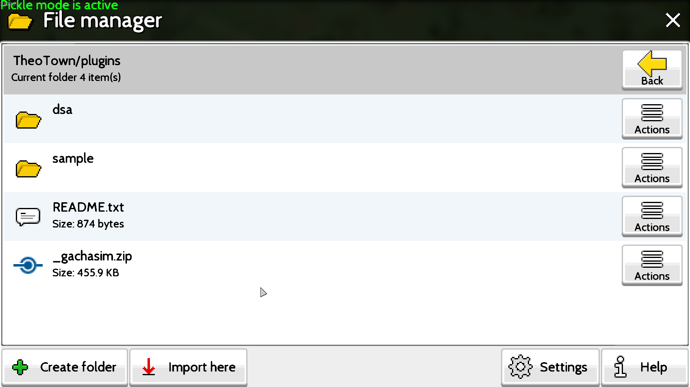

# Installing a plugin

Let's assume you found a plugin you like and downloaded the plugin file (.ttplugin, .plugin or .zip) to your device. The installation of the said file is
very simple. You would grab the plugin file and place it in the TheoTown plugins folder.

!!! note ".zip file compatibility"
    Game should be able to automatically load a plugin that is contained inside a zip file, however it can fail due to
    compatibility issues and you might have to unzip the file manually for the game to read the plugin.

Depending on the platform, folder can be found at these directories:

- Windows

    `C:\Users\(insert username)\TheoTown\plugins` or `%USERPROFILE%\TheoTown\plugins`

- Linux

    `~/TheoTown/plugins`

- MacOS

    `/user/TheoTown/plugins`

- Android:

    `/storage/emulated/0/Android/data/info.flowersoft.theotown.theotown/files/plugins`

- iOS:

    Search "TheoTown" in the file manager app and put it in the plugins folder.

If you're having difficulty accessing those directories, you may access the plugin directory through in-built TheoTown file manager
that is available from the region view menu.

## Video guide for Android

<iframe width="900" height="450" src="https://www.youtube.com/embed/3peYxuK7BS4" title="YouTube video player" frameborder="0" allow="accelerometer; autoplay; clipboard-write; encrypted-media; gyroscope; picture-in-picture; web-share" referrerpolicy="strict-origin-when-cross-origin" allowfullscreen></iframe>
