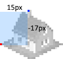

# Writing a sample plugin

To get started with plugin making for TheoTown, first we need to cover a few aspects.

!!! danger "Copyright (read this before publishing plugins for the first time)"
    Copyright is a serious thing. Obey copyright rules or you will get punished!

    [Article on copyright on the official forums](https://forum.theotown.com/viewtopic.php?t=4144).

## 1. Structure
First of all, plugins are stored in an accessible directory on your device. The exact location varies depending on the platform that you are using:

* In case of **Android** that is `Android/data/info.flowersoft.theotown.theotown/files`. From the device itself you may not be able to access that location directly. However, TheoTown should appear as some sort of virtual file storage when using the Android Files app (which can also be called by other apps in order to select files for input or output). Alternatively, you can use the built-in file explorer that can be accessed from the game menu when being in the region view.
* In case of **iOS** you can access the files via the Files app or, when the device is connected to a Mac, in the storage location for your device in the finder.
* On **PC** the files are stored in `C:/Users/YourUsername/TheoTown` (Windows) or `~/TheoTown` (MacOS and Linux).

When developing, each plugin has to be placed in an own directory. Let's say it's **sample** for our plugin example. On startup, TheoTown searches in each of these directories for ***.json**-files to load. Graphics for such a file have to lay in the same directory.

You may see a more in-depth overview of how plugins are loaded [here](../reference/technical/loading-order.md).

## 2. JSON
JSON-files are used to describe buildings in TheoTown. That said, they are (similar to XML-files) a readable format to store structured information.
[More about JSON can be found here](https://en.wikipedia.org/wiki/JSON).
We decided to use JSON as it's really simple and easy to read. Such a JSON file may look like
```json
[{
  "id": "$sample.plugin.unique.id.res00",
  "type": "residential",
  "author": "Lobby & theotheoderich",
  "width": 1,
  "height": 1,
  "frames": [{"bmp": "sample_bmp.png"}],
  "smoke": [{"id": "$smoke07", "x": 15, "y": -17}],
  "level": 1
}]
```
Every JSON file (let's call it *sample_dsc.json*) in a plugin may contain multiple building descriptions, therefore the file starts with a **[** and ends with a **]**, noting that this is a listing of something (like building objects, in this case). Never forget these brackets as the plugin might not be loaded without them!

Speaking of objects, the listing contains a number of objects, each starting with **{** and ending with **}**. Multiple objects have to be separated using a comma.

An object consists of multiply "key":"value" pairs that are used to define the properties of the object. Step for step:

* **id** - Each object has to have a unique id to identify it. So you should add some specific information about the plugin to ensure nobody else ever gonna use this id. Avoid changes to the id afterwards, as it is used to identify buildings in saved cities. Buildings with unknown id cannot be loaded.
* **type** - States the type of the plugin. See [the advanced topic](https://www.theotown.com/forum/viewtopic.php?f=41&t=1355) for more types. We will call objects that have types _drafts_.
* **author** - Here you state your name as author of the plugin.
* **width** - Tile width of the base of the building. Each tile has a pixel size of 32x16.
* **height** - Has to be the same as **width**. Therefore, only square buildings are possible.
* **frames** - This is the most important part of our definition. The frames (graphics) that are associated to our building. As this property expects an list (array) of frames we have to start with **[** and end with **]**. In that we can define a frame object using the property **bmp** which references to an image file in the same directory. Here it's the file *sample_bmp.png*. The option to provide multiple frames can be used for animations or different building variants.
* **smoke** - If you want to you can use this property to define a list of smoke spots on the building. Some smoke types like **$smoke07** are already defined by TheoTown and may be reused.
Have a look at the [listing of defined smoke types](https://forum.theotown.com/viewtopic.php?p=6653#6653) for more information.
Note that the position of the spot is relative to the drawing pivot of the building (the left corner of the base).
* **level** - Here you can set the level of the building, it has to be **1** for T (poor), **2** for TT (medium) and **3** for TTT (rich).

Each property has to be separated by a comma. String values (like property names or string values) have to be **"**quoted**"**.
In this sample, only the property **smoke** is optional[^1].

[^1]: This is not quite correct, as the game provides default values for `author` and `level` attribute, but it's recommended to
set these values explicitly.

Further properties like building time, habitant count etc. are inferred automatically for convenience. So the sample building works immediately (after restarting the game) and can be built manually in sandbox mode.


## 3. Graphics
The more difficult part when including own buildings is to create the buildings itself. You have to keep in mind that our tiles have a size of 32x16 pixels, so a building of size 2x2 (it has to be a square) needs at least a graphics size of 64x32 pixels (it's important to actually use this width so TheoTown can calculate the pivot point in the left corner of the base, which is used to draw the building).
For more details, take a look into [theo's step by step guide](https://forum.theotown.com/viewtopic.php?p=5712#5712).

<!--
Here an illustration how to measure the coordinates for the smoke of the given sample:

TODO: image is gone


The red pixel is the pivot point of our building while the blue pixel is where we want to place our smoke.

-->

In our example we use this graphics with a size of 32x25 pixels, named *sample_bmp.png*: 

<figure markdown="block">
{: style="width:256x;height:240px;image-rendering:crisp-edges;"}
</figure>

Here are some templates for you for the base of different sizes:

<!-- Do not tabulate these or it breaks-->
<div class="grid cards" markdown="block">
<figure markdown="block">
{: style="width:256px;height:128px;image-rendering:crisp-edges;"}
<figcaption>1x1 template</figcaption>
</figure>

<figure markdown="block">
{: style="width:256px;height:128px;image-rendering:crisp-edges;"}
<figcaption>2x2 template</figcaption>
</figure>

<figure markdown="block">
{: style="width:256px;height:128px;image-rendering:crisp-edges;"}
<figcaption>3x3 template</figcaption>
</figure>

<figure markdown="block">
{: style="width:256px;height:128px;image-rendering:crisp-edges;"}
<figcaption>4x4 template</figcaption>
</figure>
</div>

[Here](https://forum.theotown.com/viewtopic.php?f=41&t=3207) we have a list of base templates that contains even bigger sizes.

**Please use only self-created buildings for your TheoTown plug-ins!**

## 4. Plugin manifest
The plugin that we created will work and we will have a new residential building, however the player will not be able to manage
the plugin through the UI interface nor will it work in the online mode.

For that we need to create a plugin manifest file. The file follows the same JSON format we used above, however this time
it starts with an object, rather an array of objects:

```json title="plugin.manifest"
{
  "id": "5a06a291-980f-406e-9b77-b72814331e36",  // Unique id for the plugin, used https://www.uuidgenerator.net/
  "version": 3,                                  // Numeric version code
  "title": "Sample plugin",                      // Title for the plugin
  "text": "Just an example for a plugin.",       // Description for the plugin (optional)
  "author": "Theo&Lobby",                        // Author of the plugin
  "thumbnail": "sample_bmp.png",                 // Thumbnail image file (optional)
  "category": false,                             // Specify whether to show a category for the plugin (optional)
  "url": "https://forum.theotown.com/viewtopic.php?p=5604#5604", // An URL where to get the plugin (optional)
  "once": true                                   // Whether to ignore other occurrences of this plugin
}
```

It must be included at the root of our **sample** plugin directory and must be named exactly plugin.manifest for the game to recognize it.

While the game loads our plugin without a manifest file, that is not guaranteed to be true in the future. Therefore we recommend to always include a manifest file.

For more plugin manifest file attributes, look [here](../manifest.md).

## 5. Limitations
JSON is just a language for description. Therefore it's not possible to *program* your own buildings. Functionality is added by TheoTown itself and depends on the set properties. If you have a good idea for new functionality that should be available through plugins, please let us know.
However, you can add some sort of functionality in JSON by using [FUN](https://forum.theotown.com/viewtopic.php?f=81&t=4301).
For more fancy behaviour you could [include a Lua script](https://forum.theotown.com/viewtopic.php?f=115&t=9295) in your plugin.

Maybe you now want to create hundreds of own buildings and also download tons of them from the internet. However, there is no infinite space for plugins and therefore you should try to not create giant buildings for no reason. Especially when it comes to huge transparent parts you can usually optimize them away.

Speaking of giant buildings, just try to avoid them if possible. If not, keep in mind that the max building size is 8x8 and max building height is 256 pixels.

## 6. Debugging
As of right now, TheoTown does not provide any debugging mechanisms, so you might have to do some testing in order to find the bug if something doesn't work. Most likely there's a syntax issue in the JSON-file, so [you might check that first](https://jsonlint.com/). If there are no syntax errors, maybe you have a typing mistake in the image name.

In case of an issue with a plugin TheoTown shows a plugin error after start up which shows more information about what's wrong.
The text is also written to a file error.log in the plugin directory for reference. It should give you a hint of what went wrong.
If not, you may post your questions [on the official forum](https://forum.theotown.com/viewforum.php?f=42).

<sub>This page has been adapted from the official TheoTown forum.</sub>
