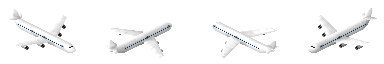
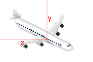

# Airplanes

Adding you own airplane to the game is straight forward. After you created your amazing graphics like this one:



You can define your airplane draft like so:
```json
[{
  "id": "$lobby_airplane_mygreatairplane00",
  "type": "airplane",
  "frames": [{"bmp": "airplane.png", "w": 96, "count": 4, "handle x": 48, "handle y": 40}],
  "title": "Big airplane",
  "text": "I'm the description.",
  "price": 1000000,
  "fly height": 200,
  "capacity": 375,
  "speed": 1
}]
```

An airplane draft consists of four frames for each direction.
Orientation for each frame works as for [cars (v2)](cars.md).

About the handle, we recommend to move it to a point where you would say that's the center of the airplane on the ground:



In case you're nice you might want to set a diamond price instead.
That's possible with:
```json
"diamond price": 20
```

<sub>
This page has been adapted from
[a topic](https://forum.theotown.com/viewtopic.php?t=4569)
on the official TheoTown forum.
</sub>
