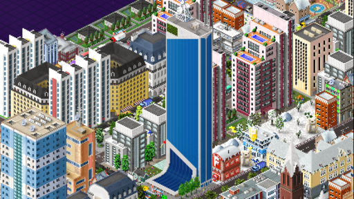

# Animations

There are cases where you might want to add animations to your buildings.
[Night lights](lights-and-night-animations.md) are also considered as animations.

Generally, animations consist of 2 parts:

- **Animation draft**, that defines an animation that we can reuse.
- **Animation array**, that is defined on a building that includes defined animation drafts.

<!-- TODO: make this more in depth-->

First of all, let's define our animation draft:
```json
[
  {
    "id": "myanimation",
    "type": "animation",
    "frames": [
      // Moment number 1
      {
        "bmp": "myanim.png",
        "move x": 5, // Our animation will be in x=5
        "move y": 16 // and y=16
      },
      // Moment number 2
      {
        "bmp": "myanim.png",
        "move x": 10, // Our animation will be in x=10
        "move y": 16  // and y=16
      }     
    ]
  }
]
```

Now to use it on a building, we would add it to the animation attribute array like so:
```json
[
  {
    "id": "buildingwithanimation",
    "type": "decoration",
    "width": 1,
    "height": 1,
    "frames": [{"bmp": "basepart.png"}],
    "animation": [
      // We reference the previously defined animation draft via ID
      {"id": "myanimation"}
    ]
  }
]
```

You can find extra attributes for animation drafts [here](../draft-types/animation.md) and animation objects [here](../attribute-types/animation/index.md).

The [Domkisas Embassy](https://forum.theotown.com/plugins/list?term=%3A198) plugin makes heavy use of animations
[to save texture space](using-animations-to-save-plugin-space.md):



You may download the plugin animation code here:</br>
[:material-file-download: embassy.zip](../assets/guides/animation/embassy.zip)

<sub>
This page has been adapted from
[a topic](https://forum.theotown.com/viewtopic.php?t=7455)
on the official TheoTown forum.
</sub>
