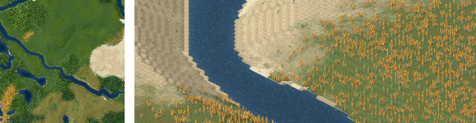
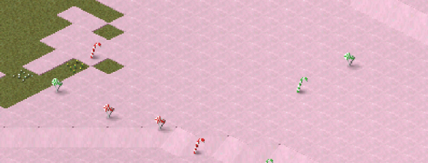

# Biomes

!!! info "Added in version 1.11.23"

{: style="width:100%;"}

The biome update includes "actual" biomes that aim to add more variety to the game.

Under the hood, biomes will be assigned to each tile of a map during generation. That biome will then determine what ground, trees and decoration will be used / spawned for that tile. Biome information will only be used during map generation and will not be stored in the map.

Biomes itself are implemented in a way that should make it possible for plugin creators to extend the system in the future.

There will be two types of biomes, one for land and one for water. The type will be selected based on the terrain height that will be generated before biomes will be applied. For now there is no use for water biomes.

Given a tile and a list of possible biomes the actual biome will be selected based on a relative probability _p_ that will be calculated for each biome. The biome of the highest probability will be used.

## Biome parameters

These are the parameters a biome can specify that will determine where the biome will be used. All of these are floats. The default values are specified after the colon.
> 
**"noise scale"**: 1 (bigger values mean bigger noise pattern) </br>
**"noise offset"**: 0 </br>
**"noise factor"**: 0 (usually in 0..1 with 0 meaning no noise contribution) </br>
**"noise variance"**: 1 (bigger values will basically splatter the noise sampling for more spread out biome edges) </br>
**"noise seed"**: random (integer value used as a seed to control the noise function, a random number by default; can be used to enforce the same noise on multiple spawn definitions)

>
**"height center"**: 0 (the target height where contribution should be max) </br>
**"height radius"**: 1 (the radius of where height should contribute) </br>
**"height offset"**: 0 </br>
**"height factor"**: 0 (usually in 0..1 with 0 meaning no height contribution)

>
**"deriv center"**: 0 (the target steepness where contribution should be max) </br>
**"deriv radius"**: 1 (the target variance from target steepness that should contribute) </br>
**"deriv offset"**: 0 </br>
**"deriv factor"**: 0 (usually in 0..1 with 0 meaning no height contribution)

> 
**"offset"**: 0 (overall probability offset) </br>
**"coverage"**: 1 (e.g. 0.5 would make appearance less likely) </br>
**"precedence"**: 1 (overall multiplier, e.g. useful for making sparse tree / decoration spawning)

As a rule of thumb you should aim for the following equation to be true:

$$
\begin{equation}
noise\_factor + height\_factor + deriv\_factor + offset \leq 1
\end{equation}
$$

This ensures that a biome does not completely displace another one.

## Tile input parameters

These are the tile dependent parameters that will be used to evaluate the likelihood of a biome. They are mentioned here for completeness.

- x (integer, 0..&lt;width of the city)
- y (integer, 0..&lt;height of the city)
- height (float, zero being coast line, snow usually starts at height 5)
- steepness (float, ranges from 0 to 1)

## The formula

Biome probability _p_ for a tile _(x, y, height, steepness)_:
> 
$$
\begin{align}
n :=& noise(x, y, noise\_scale, noise\_variance, noise\_seed) + noise\_offset \\
h :=& 1 - \frac{|height - height\_center|}{height\_radius} + height\_offset \\
d :=& 1 - \frac{|steepness - deriv\_center|}{deriv\_radius} + deriv\_offset \\
p :=& precedence \cdot \left( \frac{noise\_factor \cdot n + height\_factor \cdot h + deriv\_factor \cdot d + offset - 1}{coverage} + 1 \right)
\end{align}
$$

You can consider the _noise(x, y, noise_scale, noise_variance, noise_seed)_ as doing some magic for you that outputs a nice noise distribution using [Perlin noise](https://en.wikipedia.org/wiki/Perlin_noise).
A different noise distribution will be used for each biome unless a noise_seed was defined explicitly.

The minimum p for the default biome is 0.1 so if the probability of all other biomes is smaller than 0.1 the default biome will be used.

## Example: coast biome definition

For example the coast biome uses the following definition to spawn near the water only:
```json
{
    "id": "$biome_coast00",
    "type": "biome",
    "noise scale": 1,
    "noise offset": 0.5,
    "noise factor": 0.5,
    "noise variance": 2,
    "height center": 0,
    "height radius": 0.05,
    "height factor": 1,
    "offset": -0.5
}
```

## Ground spawning

We want to spawn ground dependent on the biome. To do so, we can either define the biomes to spawn in in the ground draft:
```json
"biome": ["$mybiomeid", ...]
```
or in the biome itself:
```json
"grounds": ["$mygroundid", ...]
```
Note that in either way you will have to make sure that the draft you are referring to was defined before.

## Tree and decoration (building) spawning

This works like for ground. In a tree or building definition you can write:

```json
"biome": ["$mybiomeid", ...]
```

Alternatively you can write in the biome itself:

```json
"tree": ["$mytreeid", ...],
"building": ["$mybuildingid", ...]
```

Like for ground the _thing_ you are referring to must have been defined previously. We recommend to order things so that biomes will be defined last. That way you can put all the spawn definitions in the respective biome objects which makes it easier to keep track of what belongs to a biome.

## Biome Ids

In case you want your ground / tree / building to be spawned in one of the pre-defined biomes you have to specify the spawning behavior in it as well as you cannot easily extend an existing biome (it's possible though by using inherit). So here's a list of the pre-made biomes so you can hook into them:

- $biome_ocean00 (this is the only water biome for now and having multiple is not yet supported)
- $biome_aspen_forest00
- $biome_deciduous_forest00
- $biome_coniferous_forest00
- $biome_mixed_forest00 (this is the default land biome in case auto spawn for a tree was set)
- $biome_boreal_forest00
- $biome_redwood_forest00
- $biome_desert00
- $biome_snow00
- $biome_rainforest00
- $biome_coast00
- $biome_grassland00
- $biome_steppe00
- $biome_flowerygrassland00
- $biome_sakura00

If you use auto spawn in your trees / ground they will be spawned in an appropriate biome automatically based on set water property. This is for compatibility with older plugins only so you should use explicit biomes if possible.


## Spawn parameters for ground, tree and building

Like for biomes you can use the presented [Biome parameters](#biome_parameters) also in the context of spawn definitions for more variety. In a biome this may look like:
```json
"ground": [{
    "id": "$mygroundid",
    ... // Spawn parameters
}],
"tree": [{
    "id": "$mytreeid",
    ... // Spawn parameters
}],
"building": [{
    "id": "$mybuildingid",
    ... // Spawn parameters
}]
```

While spawn parameters in biomes get used to calculate a probability p this value was not actually used as a probability. In contrast to that, p will be used as a relative probability for ground, trees and buildings. For trees and buildings the sum of all probabilities for a tile determines the probability to spawn a tree / building at all. For ground this filtering does not apply as a ground has to be selected for every tile.

## Example: Candy Land

<sub>(sugar is unhealthy, don't eat too much of it)</sub>

{: style="width:100%;"}

To get you started we prepared a little toy biome for you: Candy land! It features a ground type, tree (candy) and a biome that spawns them. The biome is configured to not spawn too often. The candy is configured to spawn primarily on zero steepness. The ground is configured to spawn everywhere in the biome and to not blend with other ground ("blending": false). Here's the code:

```json
[
    {
        "id": "$ground_candy00",
        "type": "ground",
        "template": "$template_ground",
        "blending": false,
        "frames": {"bmp": "ground.png", "handle y": 9},
        "border frames": {"bmp": "ground.png", "handle y": 9, "copies": 15},
        "map color": {"r": 255, "g": 220, "b": 240}
    },

    {
        "id": "$tree_candy00",
        "type": "tree",
        "frames": {"bmp": "candy.png", "w": 32, "count": 4},
        "map color": {"r": 220, "g": 80, "b": 80}
    },

    {
        "id": "$biome_candy00",
        "type": "biome",

        "title": "Candy Land",
        "preview frames": {"bmp": "preview.png", "handle y": 0},

        "noise factor": 1,
        "noise scale": 4,
        "coverage": 0.3,

        "ground": ["$ground_candy00"],

        "tree": {
            "id": "$tree_candy00",
            "noise factor": 1,
            "noise scale": 0.5,
            "deriv factor": 1,
            "deriv radius": 0.5,
            "offset": -1,
            "precedence": 0.3
        }
    }
]
```
Since it's contained within a single file we have full control over the order in which things are loaded.

For reference, this is how it would look like if the biome was defined first (i.e. because it is part of the game):
```json
[
    {
        "id": "$biome_candy00",
        "type": "biome",

        "title": "Candy Land",
        "preview frames": {"bmp": "preview.png", "handle y": 0},

        "noise factor": 1,
        "noise scale": 4,
        "coverage": 0.3
    },

    {
        "id": "$ground_candy00",
        "type": "ground",
        "template": "$template_ground",
        "blending": false,
        "frames": {"bmp": "ground.png", "handle y": 9},
        "border frames": {"bmp": "ground.png", "handle y": 9, "copies": 15},
        "map color": {"r": 255, "g": 220, "b": 240},

        "biome": ["$biome_candy00"]
    },

    {
        "id": "$tree_candy00",
        "type": "tree",
        "frames": {"bmp": "candy.png", "w": 32, "count": 4},
        "map color": {"r": 220, "g": 80, "b": 80},

        "biome": {
            "id": "$biome_candy00",
            "noise factor": 1,
            "noise scale": 0.5,
            "deriv factor": 1,
            "deriv radius": 0.5,
            "offset": -1,
            "precedence": 0.3
        }
    }
]
```

You can download the whole plugin here: </br>
[:material-file-download: candy_land.zip](../assets/guides/biomes/candy_land.zip)

<sub>
This page has been adapted from
[a topic](https://forum.theotown.com/viewtopic.php?t=18574)
on the official TheoTown forum.
</sub>