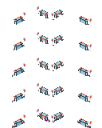

# Bus stops

A bus stop draft can be defined like:
```json
{
  "id": "$my_busstop00",
  "type": "bus stop",
  "width": 1,
  "height": 1,
  "influence passenger bus": 30,
  "frames": [
    {"x":512,"y":864,"w":32,"h":32,"count":4}, // no people waiting
    // Additional frames are optional
    {"x":512,"y":896,"w":32,"h":32,"count":4},
    {"x":512,"y":928,"w":32,"h":32,"count":4}, // some people waiting
    {"x":512,"y":960,"w":32,"h":32,"count":4},
    {"x":512,"y":992,"w":32,"h":32,"count":4}  // a lot of people waiting
  ],
  "capacity": 32,
  "price":800
}
```

These are the frames in use:



You have to provide at least 4 frames for 4 different placements on a road.
Any additional 4 frames are used to visualize the amount of waiting people at this bus stop.

<sub>
This page has been adapted from
[a topic](https://forum.theotown.com/viewtopic.php?t=5293)
on the official TheoTown forum.
</sub>
