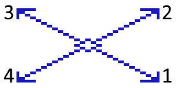
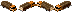
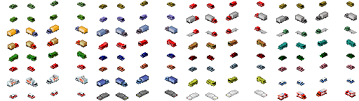

# Cars

This guide details the steps for creating of your own cars and how to use them.

## 1. Car definition
As usual, car plugins are defined by using a json file as textual description of your plugin.

A car plugin's json file can look as simple as this:
```json
[
  {
    "id":"$lobby_carplugin00",
    "type":"car",
    "frames":[
      {"bmp":"carsample.png","w":18,"h":12,"count":4}
    ],
    "v2":true
  }
]
```

You will notice that we provide 4 frames here. That's needed as we need a frame (image) for each direction in which the car can drive. We indexed the directions as followed:



So our actual image carsample.png may look like this:



Notice how we load 4 frames from a single image by providing the width and height of each frame and the number of frames we want to extract. The plugin loader will automatically load "count" many frames of the given width and height from left to right out of the provided image. You can provide multiple cars within a single plugin by just providing more frames. The total number of frames has to be a multiple of 4.

It's worth to mention that `"v2": true` indicates that we want to use the second generation of car loading. We recommend that as it's much easier to use and takes less expensive texture space. However, a lot of cars are still internally defined using the old system. The provided frames there have to look like that:


The border of free space of each frame (size 32x16) as well as the index for each direction differ from the v2 approach. The space is needed here as it's used for positioning.

List of all supported car attributes can be found in the [`car`](../draft-types/car.md) draft reference.
It documents extra features such as flags and other attributes in greater detail.

## 2. Spawn cars
Now assume we want our sample building `$sample.plugin.unique.id.res00` from
[our sample plugin](../getting-started.md) to spawn cars from our car draft `$lobby_carplugin00`.
We can do that by defining a
[`car spawner`](../attribute-types/spawners/car-spawner.md) object
with the following attributes:

- **cars** - An array of car IDs to spawn.
- **radius** - Radius for the cars to be spawned.
- **count** - Number of cars that should be spawned.

So our sample plugin draft may look like
```json
[
  {
    "id":"$sample.plugin.unique.id.res00",
    "type":"residential",
    "author":"Lobby & theotheoderich",
    "width":1,
    "height":1,
    "frames":[{"bmp":"sample_bmp.png"}],
    "smoke":[{"id":"$smoke07","x":13,"y":-14}],
    "level":1,
    "car spawner":[
      {
        "cars":["$lobby_carplugin00"],
        "radius":10,
        "count":5
      }
    ]
  }
]
```

Please notice that you have to define your car **before** using it in any other plugin.

## 3. Overriding existing cars

!!! warning "Overriding cars was only needed in the past to add your own residential/industrial cars into the game. See [this guide](car-identification.md) on how this should be done since version 1.4.37."

As discussed [in this forum post](https://forum.theotown.com/viewtopic.php?p=19902#p19902) you can override existing cars
in the game by using the same ID. This works as plugins are loaded after internal drafts so that the existing draft will be overridden (in most cases, it doesn't work well for ground drafts for example).

You can find the IDs of predefined cars in the [resources](../resources/json.md).

## 4. Reusing car frames from the game
As discussed in [this forum thread](https://forum.theotown.com/viewtopic.php?t=2302) we allow you to use our car graphics in your own plugins. However, you have to mention us (Lobby and theo) as authors when distributing it.
The easiest way to "steal" our car frames is by using the _frame stealing_ feature which we also used [for our people animation](people-animation.md).
You can do that by using the car IDs found in [resources](../resources/json.md).

Another way to get car frames is by directly copy them into your own graphics. Here we provide some of our car graphics:



You'll find the bus graphics in the [world texture](../resources/world-texture.md#world_0_0png).

## Diagonal cars

!!! info "Added in version 1.9.68"

Diagonal cars use 8 instead of 4 frames. 4 for diagonal axis and 4 for the regular axis.

All you just need to do is specify `"frames per variant": 8` attribute for the car drafts.

The following example is how diagonal firetrucks are implemented:
```json
[{
    "id":"$carfirebrigade00",
    "type":"car",
    "frames":[
      // This array has 8 frames
      {"x": 512, "y": 657, "w": 32, "h": 18, "count": 4},
      {"x": 128, "y": 365, "w": 32, "h": 19, "count": 4, "offset y": 3072} 
    ],
    "frames per variant": 8, // We let the game know that we use 8 frames per variant, otherwise it would treat 8 frames as 2 separate variants 
    "animation":[
      {
        "id":"$animationcaralertlights00",
        "pos":[16,-10, 10,-4, -4,-9, 4,-13],
        "important":true
      },
      {
        "id":"$animationcaralertlights00",
        "pos":[18,-9, 12,-5, -2,-8, 6,-14],
        "important":true
      },
      {
        "id": "carlight_red",
        "pos": [11, 4, 0, 0, 0, 0, 25, 1],
        "frames": [0, 3]
      },
      {
        "id": "carlight_red",
        "pos": [13, 5, 0, 0, 0, 0, 27, 0],
        "frames": [0, 3]
      },
      {
        "id": "carlight_yellow",
        "pos": [0, 0, 19, 5, 3, 0, 0, 0],
        "frames": [1, 2]
      },
      {
        "id": "carlight_yellow",
        "pos": [0, 0, 21, 4, 5, 1, 0, 0],
        "frames": [1, 2]
      }
    ],
    "flag military":true,
    "flag airport":true,
    "flag emergency": true,
    "chargeable": false,
    "meta":{"tags":{"fire brigade":{}}}
}]
```

In regard to the order of frames it works the same like before for the first 4 frames (which will have different order when v2 is set to true). The next 4 diagonal frames are always ordered like this:


## How to define a bus?

The bus system uses a feature to generate cars in different colors.

All you have to do is add the following line into your bus car definition:

```json
"template":"$template_bus00"
```

The bus will then be added to the variants of busses.

<sub>
This page has been adapted from
[a topic](https://forum.theotown.com/viewtopic.php?t=2346)
on the official TheoTown forum.
</sub>
