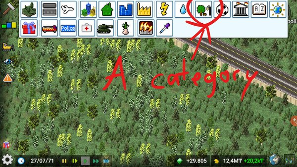
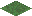
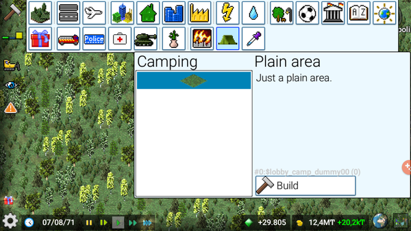
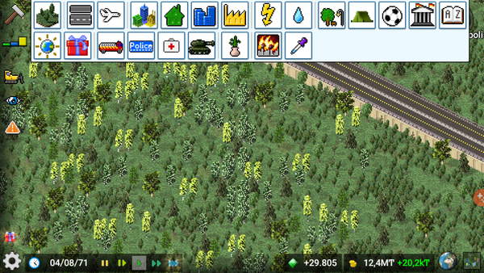
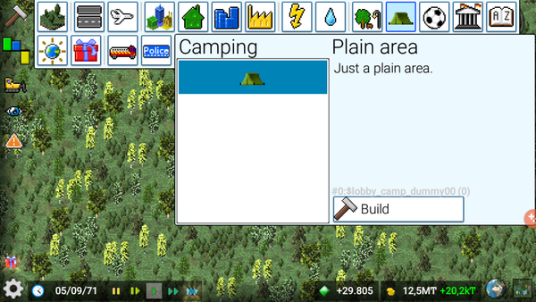

# Categories

!!! info "Added in version 1.3.37"

Game allows you to define your own categories. Here you can see what that means:



Let's say we have the following plugin:
```json
[
  {
    "id":"$lobby_camp_dummy00",
    "type":"park",
    "title":"Plain area",
    "text":"Just a plain area.",
    "width":1,
    "height":1,
    "frames":[{"bmp":"dummy.png"}]
  }
]
```

{: style="width:25%;image-rendering:crisp-edges;"}

As it's a building of type park it will be put into the park category automatically. We want to put it into an own camping category.

So let's define a new category for camping:
```json
{
    "id":"$cat_lobby_camp00",
    "type":"category",
    "title":"Camping",
    "frames":[{"bmp":"icon.png"}],
    "ordinal":10
}
```
As icon we use this 26x26 pixel sized image:

{: style="width:25%;image-rendering:crisp-edges;"}

I recommend to always use a size of 26x26 pixels for icons for consistency. In order to put our plugin into this category we have to specify the category manually:
```json
{
    "id":"$lobby_camp_dummy00",
    "type":"park",
    "category":"$cat_lobby_camp00",    // This way we define the category to put this park into
    "title":"Plain area",
    "text":"Just a plain area.",
    "width":1,
    "height":1,
    "frames":[{"bmp":"dummy.png"}]
}
```
Pay attention on that the category you're referring to has to be defined before your plugin. Otherwise it cannot be assigned. The result looks now like this:



Now you may want to put your category to a more meaningful position: behind the existing park category. To do so, we can use the attribute ordinal which can be also used to order items within a category:
```json
{
    "id":"$cat_lobby_camp00",
    "type":"category",
    "title":"Camping",
    "frames":[{"bmp":"icon.png"}],
    "ordinal":10    // Specify own position (after park, in this case)
}
```
The number you provide for ordinal determines which position should be used, with 0 being the first place. The result:



Last but not least we may want to use another preview for our cool plank area. To do so, we can provide a preview frame like this in our plugin:
```json
{
    "id":"$lobby_camp_dummy00",
    "type":"park",
    "category":"$cat_lobby_camp00",
    "title":"Plain area",
    "text":"Just a plain area.",
    "width":1,
    "height":1,
    "frames":[{"bmp":"dummy.png"}],
    "preview frames":[{"bmp":"icon.png"}]   // A single frames to use for preview
  }
```

Result:



The whole code in a single file looks like this:
```json
[
  {
    "id":"$cat_lobby_camp00",
    "type":"category",
    "title":"Camping",
    "frames":[{"bmp":"icon.png"}],
    "ordinal":10
  },
  {
    "id":"$lobby_camp_dummy00",
    "type":"park",
    "category":"$cat_lobby_camp00",
    "title":"Plain area",
    "text":"Just a plain area.",
    "width":1,
    "height":1,
    "frames":[{"bmp":"dummy.png"}],
    "preview frames":[{"bmp":"icon.png"}]
  }
]
```

You can use the code:
```json
"separator": true
```
to put a line that separates parts of a category.

## Nested categories

You can also nest categories under other categories by specifying the `category` attribute for
the category itself:
```json
{
    "id":"$cat_lobby_camp00",
    "type":"category",
    "category": "$cat_park00",
    "title":"Camping",
    "frames":[{"bmp":"icon.png"}],
    "ordinal":10
}
```

Our camp category will now be nested under the park category.

!!! info "If the player uses the old toolbar, the category will be put besides the parent category."

## Inheriting ordinality

You can inherit the ordinal status from a draft to place your category beside it like so:
```json
"ordinal from":"$existing_category_id_00",
"ordinal":1,
```

This will place your category after the `$existing_category_id_00`.

## Tips and tricks

### Defining a shared category between plugins

When the category feature was initially released, plugin creators chose to create a custom category as a separate dependency plugin that players had to install alongside the plugin that depended on the said category.

This, however, lead to a dreaded error where a custom category could not be found, in case the dependency was not installed:
```txt
In some_plugin.plugin:

java.lang.IllegalStateException: When loading "$COOL_BUILDING": No category $my_custom_cat00 could be found
```

A recommendation now is to redefine the category in plugins that need it and then using the `once` attribute.

Say, we want to share `$cat_lobby_camp00` category in 2 of our plugins.
We would simply define the category with the `once` attribute for both plugins:
```json
{
    "id":"$cat_lobby_camp00",
    "type":"category",
    "category": "$cat_park00",
    "title":"Camping",
    "frames":[{"bmp":"icon.png"}],
    "once": true,
    "ordinal":10
}
```

The `"once": true` attribute indicates to the game that a draft of the specified should be loaded once and ignore
other definitions by the same ID.


<sub>
This page has been adapted from
[a topic](https://forum.theotown.com/viewtopic.php?t=4269)
on the official TheoTown forum.
</sub>
