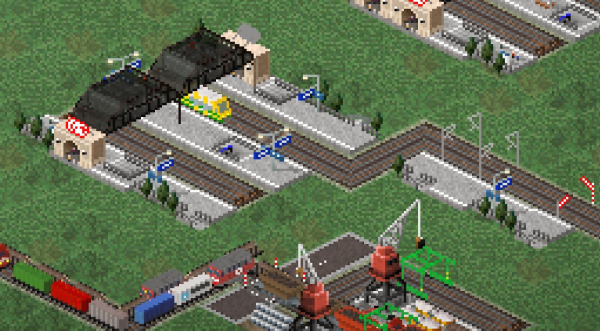
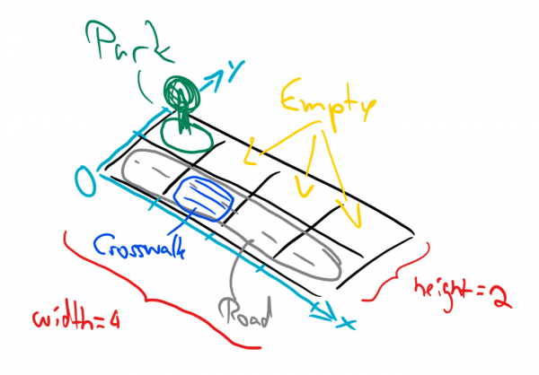
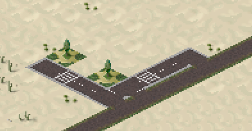
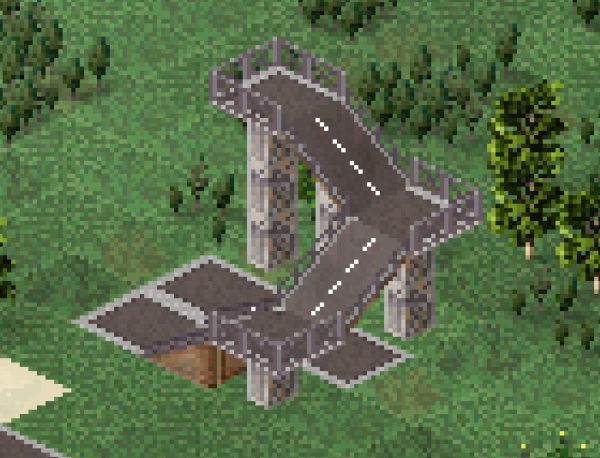

# Compositions

Compositions are a way to combine buildings, roads, road decorations and trees as a building. An important property of compositions is the support of a non square ground size. Therefore it could be used to make up non squared buildings for example.

For example, compositions are used for the pre-built train stations:



## Definition
Technically compositions are defined as buildings that contain a list of the "things" they are built up with. The user can build it like a regular building, the preview displays the actual contents of the building. However, once the player issues to build the building the actual contents of the building will be built instead.

Basic structure (here for the train station as an example):
```json
[
  {
    "id": "$somerandomid00",
    "type": "decoration",
    "width": 4,
    "height": 2,
    "composition": [
      {"id": "$trainplatform03","x": 0,"y": 0,"frame": 1}, // A platform
      ...
      {"id": "$rails00","x0": 0,"y0": 1,"x1": 3,"y1": 1},  // Rails/road
      ...
      {"id": "$railroof01","x": 1,"y": 1},                 // Road decoration (for the rail)
      ...
    ]
  }
]
```

To understand how it's built up let's try to make a composition of the following:



So basically a road with a crossing on it and a park. The size of the building is 4x2. The basic structure of the building might look like:
```json
[{
  "id": "$compositionexample00",
  "type": "decoration",
  "width": 4,
  "height": 2,
  "composition": []   // We will put something in here
}]
```

!!! info "Compositions have to be rotation aware."

Note that we will put the components of the composition into the composition array. Let's begin with the park. Since it's a building (we'll use the park with id $park01 for it) all we have to provide is the id, the position x, y within the composition. Optionally we can specify which frame of the park should be used. If we don't provide a frame the game will pick one randomly (if multiple are available). The code for the park:

```json
{"id": "$park00", "x": 0, "y": 1, "frame": 0}
```

The next thing will be the road. We will use $road01 (the country road) and have to provide the starting position x0, y0 and the target position x1, y1. To form a line that is axis aligned these parameters have to obey x0 == x1 or y0 == y1 (or both). With that, the code for the road would be:

```json
{"id": "$road01", "x0": 0, "y0": 0, "x1": 3, "y1": 0}
```

Note that y0 == y1, so the condition mentioned above is fulfilled. Roads will connect to neighboring roads automatically if they intersect with them or if the start/end point is near to a connectable road.
Last but not least we want to put a crossing on the road. For that we will use the road decoration of id $roaddeco_crosswalk00. Similar to buildings it's sufficient to provide the id as well as a position x, y:

```json
{"id": "$roaddeco_crosswalk00", "x": 1, "y": 0}
```

**Done!**

Let's insert these objects into the composition array above and we get :json 
```json
[{
  "id": "$compositionexample00",
  "type": "decoration",
  "width": 4,
  "height": 2,
  "composition": [
    {"id": "$park01", "x": 0, "y": 1, "frame": 0},
    {"id": "$road01", "x0": 0, "y0": 0, "x1": 3, "y1": 0},
    {"id": "$roaddeco_crosswalk00", "x": 1, "y": 0}
  ]
}]
```

Alternatively you may download it as a ready to play plugin (no external files needed):

[:material-file-download: composition_example.json](../assets/guides/compositions/composition_example.json){:download="composition_example.json"}

which results in:



As you can see it's possible to rotate the composition. If rotation aware buildings are part of the composition they will rotate accordingly.


## TheoTown 66 changes 



```json
[{
  "id": "$compositionexample01",
  "type": "decoration",
  "width": 3,
  "height": 3,
  "composition": [
    {"id": "$road01", "x0": 0, "y0": 0, "x1": 2, "y1": 0,"l0":0,"l1":1},
    {"id": "$road01", "x0": 2, "y0": 0, "x1": 2, "y1": 2,"l0":1,"l1":2},
    {"id": "$road01", "x0": 2, "y0": 2, "x1": 0, "y1": 2,"l0":2,"l1":3},
    {"id": "$road01", "x0": 0, "y0": 1, "x1": 2, "y1": 1,"join":false}
  ]
}]
```

For road decorations and bus stops you can provide a **level** attribute (0 by default).

New attributes were added for roads in compositions, namely:

### l0, l1
>
Use these to specify the start and the end level of the road with "l0" being the start, and "l1" the end level.
>
The default values are 0 which means on ground (also in context of terrain; road levels are always relative to the ground). The behavior is the same as if you would use the road tool to build a road by hand (e.g. start and end point of the road are always flat)

### join

> 
By default, the roads in road compositions join to other roads. However, in some cases you may not want that to happen. Now you can prevent that by using:
>
```json
"join":false
```
>
The road will still align to other roads that it intersects.

You may for example create intersections with these. The composition extractor mentioned below doesn't work for roads that are not on ground.

Since version 1.10.62 you can also include bus stops in your compositions. Lines for bus stops will look like that:
```json
{"id": "$busstop00", "x":1, "y":0, "level":0}
```

## Tool
To make building up a composition easier there's a tool to convert a selected rectangle from a city to corresponding json code. It's part of the **Plugin Creator Tools** that you may find in the Plugin Store (you may find it via search function or listed in Categories->Tools).

Once you have installed the tool(s) you can select it from the toolbar. After that mark the area you want to create a json composition code for. The code will be copied into your clipboard then. This may look like:
```json
{
  "width":4,"height":2,
  "composition":[
    {"y0":0,"x0":0,"y1":0,"x1":3,"id":"$road01"},
    {"level":0,"x":1,"y":0,"id":"$roaddeco_crosswalk00"},
    {"x":0,"y":1,"id":"$park01","frame":0}
  ]
}
```
Note that it's up to you to add at least an id as well as a building type (e.g. decoration) to it.

!!! warning "Known issues"
    - The tool does not always handle road curves correctly.
    - Road levels aren't supported, yet.

<sub>
This page has been adapted from
[a topic](https://forum.theotown.com/viewtopic.php?t=9694)
on the official TheoTown forum.
</sub>