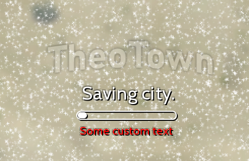

# Custom loading texts/topics



The short messages that are shown on loading screen are called topics.
Version 1.10.22 lets you add your own topics into the game by defining a draft of type `topic`.
That draft's text will then be shown if the topic gets displayed by the game.

It's as simple as that:
```json
[{
    "id": "$topic_custom_unique_id",
    "type": "topic",
    "text":"Some custom text",        // Text to show
    "weight": 10,                     // 1 by default
    "color": {"r": 255,"g": 0,"b": 0} // Color, yellow by default
}]
```

The optional `weight` attribute can be used to specify the likelihood of that topic to be shown relative to other topics. The default value is 1. A value of 2 would make it two times more likely for the topic to be shown.

The optional `color` attribute can be used specify a custom color for you topic. By default the game will use yellow to draw the topic.

!!! warning "Warning"
    Be careful to use a reasonable weight, otherwise your plugins may not get approved.

<sub>
This page has been adapted from
[a topic](https://forum.theotown.com/viewtopic.php?t=14215)
on the official TheoTown forum.
</sub>
