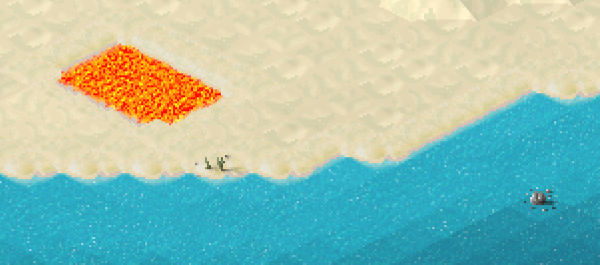

# Custom water

!!! info "Added in version 1.9.78"

{: style="width:100%;"}

Since version 1.9.78 the game features tile based water drawing instead of area filling based one. This adds several new possibilities in that it should fix some drawing issues and allows for more water customizations. (See this deprecated topic on how it worked before: https://forum.theotown.com/viewtopic.php?f=41&t=5242)

Let's have a look at how changing the existing water can be achieved now:
```json
[
  {
    "min version": 1978,  // Don't forget to specify when uploading to store
    "id": "$water00",     // Let's change the existing water
    "inherit": true,      // By using inherit we only have to specify stuff that changes
    "type": "ground",
    "frames": [
      {"bmp": "water_tiles.png", "w": 32, "handle y": 4, "count": 32}
    ],
    "sparkle frames": [
      {"bmp": "sparkle_tiles.png", "w": 32, "handle y": 4, "count": 32}
    ],
    "map color": {"r": 39, "g": 168, "b": 193}  // Let's use an appropriate color in the minimap
  }
]
```


 <!-- TODO: reconcile -->

As you can see the graphics are now tile based. The game switches between the various frames smoothly so you might not need as many frames as used in here. The optional sparkle frames are used as an overlay of unshaded sparkle effects that will also be animated.


A new feature is that there can be different types of water in the game. Here's an example of how a lava water type could be implemented:
```json
[
  {
    "min version": 1978,  // Don't forget to specify when uploading to store
    "id": "$lava00",
    "type": "ground",
    "water": true,        // It's not really water, but that's how it works
    "frames": [
      {"bmp": "lava_tiles.png", "w": 32, "handle y": 4, "count": 32}
    ],
    "edge frames": [{"x": 192, "y": 96, "w": 16, "h": 48, "count": 2}],
    "dark water color": {"r": 255, "g": 255, "b": 255}, // Prevent it form being dark dependent on depth
    "light water color": {"r": 0, "g": 0, "b": 0},      // Prevent it from being lighter near the coast
    "water speed": 0.5,   // Slower animation seems appropriate
    "light": true,        // Let it glow in the night
    "map color": {"r": 255, "g": 100, "b": 20}  // Let's use an appropriate color in the minimap
  }
]
```


<sub>
This page has been adapted from
[a topic](https://forum.theotown.com/viewtopic.php?t=13240)
on the official TheoTown forum.
</sub>
