# Custom Shaders 

What are shaders and what can we do with them in the context of plugins? This guide tries to give you some insights on that.
For discussion you can use [this topic](https://forum.theotown.com/viewtopic.php?f=42&t=16849).

Due to the complexity of the topic I will complete the sections as I find time to.
For now I am happy to finally preset _something_ you can play with. To fully take advantage of shader plugins more knowledge about the GLSL Shading Language, UV-Coordinates, other uniform variables etc. will be required. The Plugin Creator Tools in the plugin store also contains some shaders that can be used for testing purposes.

## 1. General Overview
Before we start about how shader plugins can be written I want to settle down on the following: Writing shaders is hard. Especially if you must write shader code that is compatible with different platforms, drivers, OSs and must be performant while doing so. The OpenGL shading language (GLSL) that is used for writing shaders is not forgiving about syntax mistakes nor does it provide easy-to-use debugging facilities if something goes wrong. Error messages can be cryptic sometimes.

That being said, let's dive into it.

What is a shader? When rendering a game, we essentially tell the GPU to draw a lot of (textured) triangles. This also applies to a pixel game like TheoTown simply because that's what GPUs are optimized for. You may wonder: "Where are these triangles? All I see is pixels." Well, to draw textured rectangles, the game draws two adjacent triangles, so called quads. In this context a textured rectangle is just a rectangular image that may contain transparency in its texture.
 
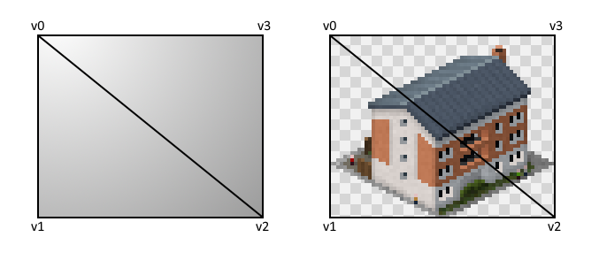

In the early days of GPU hardware, the functionality to draw (textured) triangles was hardwired into the hardware which led to the so-called fixed function pipeline. However, folks noticed that this is a quite limited approach in that it did not allow for “things” (like special effects) that were not integrated into the chips. So, the idea for a more generic approach was born: the programmable rendering pipeline. In that, specific steps of the rendering pipeline can be handled by (small) user provided programs called shaders. These shaders will be executed directly on the GPU and can make use of the GPU’s highly parallel architecture.

So, in the specific case of TheoTown, what part of rendering is programmable?

* Vertex shader

    The vertex shader maps vertex points (here these are the points of the triangles, see v0, …, v3 in the image above) to the target position on the screen. It can furthermore pass attributes like texture coordinates and colors to the fragment shader that will be interpolated for the screen pixels (fragments) automatically.

* Fragment shader

    The fragment shader will be executed for each screen pixel (fragment) that a triangle covers. Its task is to determine the target color of that pixel e.g., by looking into a texture. Transparency in the resulting color will be blended with the existing color of the fragment.

So far, the explanations are quite abstract so let's make it a bit more concrete by having a look into the default shaders that do not modify the graphics in any way.

Vertex shader:
```glsl
// Attributes is the data that is associated to each vertex that will be process by the vertex shader
attribute vec2 vVertex;
attribute vec4 vColor;
attribute highp vec2 vTexCoord;

// Uniforms are general (environment) values provided by the runtime
uniform vec2 viewport;
uniform vec2 offset;

// Varyings are the outgoing values for each processed vertex
varying highp vec2 texCoord;
varying lowp vec4 vertexColor;

// The main function does the processing of attributs + uniforms to varyings + gl_Position
void main() {
	texCoord = vTexCoord;
	vertexColor = vColor;
	gl_Position = vec4((vVertex.x + offset.x) * viewport.x - 1.0,
	                   (vVertex.y + offset.y) * viewport.y + 1.0, 0.0, 1.0);
}
```

Fragment shader:
```glsl
precision lowp float;
// ^ On some platforms we have to tell the GPU what precision to use for floating point operations for the fragment shader
// Don't modify this line and don't write something before it as the game has to remove it for some platforms

// Uniforms are runtime provided values, here the world texture that contains all graphics as well as the saturation setting
uniform sampler2D texture;
uniform float saturation;

// Varyings should match the varyings of the vertex shader. Here these are used as input values.
varying highp vec2 texCoord;
varying lowp vec4 vertexColor;

// The main function does the target color calculation and stores it in gl_FragColor
void main() {
	vec4 col = texture2D(texture, texCoord);
	col *= vertexColor;

	float light = (col.x + col.y + col.z) * 0.333333;
	col = vec4(saturation * (col.xyz - vec3(light)) + vec3(light), col.a);

	gl_FragColor = col;
}
```

The json get these shades into the game looks like the following (the file names of the shader code files don't matter):
```json
[{
    "id":"$shader_myownshader00",
    "type":"shader",
    "title":"Test shader",
    "vertex":"vertex.src",
    "fragment":"fragment.src"
}]
```

After (re-)starting the game there should now be a "Test shader" option available in Settings->Graphics->Shader. After selecting it the game should look and run like before. After all, we just re-defined the default shader.

Here you'll find the shader to use as a template:</br>
[:material-file-download: sample_shader.zip](../../assets/guides/custom-shaders/sample_shader.zip)


Due to the complexity of the topic I will write follow-up tutorials about shaders as I find time to. For now I am happy to finally preset _something_ you can play with. To fully take advantage of shader plugins more knowledge about the GLSL shader language, UV-Coordinates, other uniform variables etc. will be required. The Plugin Creator Tools in the plugin store also contains some shaders that can be used for testing purposes.

## 2. General Concepts

To understand GLSl shader code we have to have a closer look into some conceptional features of the language first.

### main() function
Both, vertex and fragment shaders have to define a main() function that will be called by the GPU on a per vertex / per fragment basis respectively. In both cases the functions have to "output" data by writing to gl_Position / gl_FragColor native variables.

### uniforms
Uniform variables are variables that are provided by the outer program (TheoTown in this case). They have to be defined in the shader code in order to be used. The game will identify and fill them by name. They can be accessed in both, vertex and fragment shaders. A list of available uniform variables will be provided later.

### attributes
Attributes are values that are provided per vertex. These will be filled in by the game and must match the expected names. The most common vertex attributes are vertex position (2D in case of TheoTown), color and texture coordinates.

### varyings
Vertex shader can output data that can then later be used in the fragment shader. For that, both codes must define the same varying variables. The vertex shader can then write values into them (per vertex). The fragment shader will later be called for every fragment. Since fragments are usually "in between" vertices the varying data that is presented to each fragment gets interpolated between the given values of the corresponding vertices. Common varying variables are texture coordinates and color.

### Numbers
You write numbers just like this:
```glsl
float x = 42.0;
```
You **have** to write floating point numbers or numbers that are used in a floating point context with the dot notion. Failing to do so will make your shader incompatible with some hardware.

### Vector data types
GLSL makes it easy to do vector arithmetic by providing vector datatypes called vec2, vec3, ... These can be constructed in code like that:

```glsl
vec3 color = vec3(1.0, 0.0, 0.0); // This would be red
```

Given two vec3s a and b we can do simple math with them:
```glsl
vec3 c = a + b; // Same as vec3 c = vec3(a.x + b.x, a.y + b.y, a.z + b.z)
```

### Colors
In GLSL colors are usually represented as vec3 or vec4 (order: r,g,b; vec4 featuers a transparency value a) whose entriey range from 0.0 to 1.0.

### Premultiplied Alpha
Normally, given a background color background and a foreground color foreground with transparency alpha the formula to blend them looks like this:
```glsl
blended_color = (1 - alpha) * background + alpha * foreground
```
However, since foreground and alpha are usually sampled from a texture we can "premultiply" the colors in the texture to save the alpha * foreground multiplication during runtime. In this case, the formula looks like this:
```glsl
blended_color = (1 - alpha) * background + premultiplied_foreground
```
In TheoTown all textures are premultiplied which means that your fragment shader will have to output premultiplied colors, too.

### Precision modifiers
In the given code you will see keywords like highp and lowp. These are precision hints for the GPU on what precision to use for these datatypes and computations with them. highp can be slower but is needed for example for texture coordinates on the world texture to avoid artifacts. However, these hints are not guaranteed to have any effect at all. Furthermore, they are not even supported on all platforms and may therefore removed from your code by the game.
For compatibility reasons your fragment shader code **must** begin with this line:
```glsl
precision lowp float;
```

### Built-in functions
GLSL has some standard built-in functions. </br>
Trigonometry: sin, cos, tan, asin, acos, atan </br>
General: pow, log2, sqrt, abs, max, min </br>
Geometrical (work on vector datatypes): length, distance, normalize, reflect

## 3. How the default vertex shader works in detail

Although the presented default shader code above does “nothing” in terms of looks it still has a significant of code that is needed just to make things work. To get a better understanding of how it achieves this let’s have a deeper look at smaller pieces of the code.

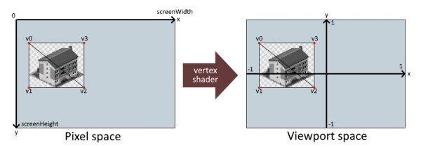

The vertex shader is responsible for mapping vertex positions (the vertices of the triangles / quads that will be drawn) to viewport positions. This step is usually needed as our vertex positions use a different coordinate system than the one that represent locations on screen (trivial example: in a 3D world we would map 3D vertices to 2D positions on the screen). In terms of TheoTown vertices are just 2D points and the mapping can be expressed as a combination of applying an offset and a scaling factor. These are provided as so called uniforms that will be filled in by the runtime (it will do so by name):

```glsl
uniform vec2 viewport;
uniform vec2 offset;
```

Position is not the only attribute that vertices can have. Other attributes are color (can be used to color the quads) and texture coordinates (used to draw an “image”). We must define them so that the runtime can provide them for us (the naming is important):

```glsl
attribute vec2 vVertex;
attribute vec4 vColor;
attribute highp vec2 vTexCoord;
```

To use them later the vertex shader has to declare placeholders to “export” them which is what this code is used for:

```glsl
varying highp vec2 texCoord;
varying lowp vec4 vertexColor;
```

The mapping logic and filling of exported (varying) variables happens in the main() function:

```glsl
void main() {
  texCoord = vTexCoord;
  vertexColor = vColor;
  gl_Position = vec4((vVertex.x + offset.x) * viewport.x - 1.0,
    (vVertex.y + offset.y) * viewport.y + 1.0, 0.0, 1.0);
}
```

This function will be called for each vertex (the attribute values will be filled by then automatically). It has to set all of the exported variables and calculate and output the viewport position of the vertex by setting gl_Position.

## 4. How the default fragment shader works in detail

The default vertex shader presented above does calculate the coordinate transformation from pixel to viewport space. Additionally, it feeds some "varying" vertex data like texture coordinates and colors for the following shader stage: the fragment shader. The fragment shader is the shader code that will actually determine [b]what[/b] will be drawn (instead of [b]where[/b]). You can think of the fragment shader as a piece of code that will be called for all pixels ("fragments") that are part of a triangle.

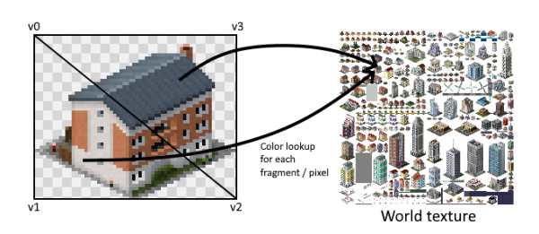

Due to some compatibility reasons the fragment shader code has to start with a precision statement that states what precision should be used for floating point numbers by default. I recommend to simply take this line as it as and never change it:

```glsl
precision lowp float;
```

Like in the vertex shader uniform variables (these are the ones that will be fed in by the environment und usually are constant per frame / drawing unit) can be defined for later use in the main function. Here we define a float saturation value that will contain the color saturation setting of the game. Furthermore, we define the texture that will contain the "world texture" where we will sample the pixel color from. The world texture contains [i]all[/i] graphics of the game. Every "image" within the world texture can therefore be drawn if the texture coords of it are known.

```glsl
uniform sampler2D texture;
uniform float saturation;
```

To use the varying variables defined in the vertex shader, we have to re-define them in the fragment shader. The datatypes and names have to match the ones defined in the vertex shader. Since varyings were previously defined for vertex points only - while fragments are located in between these points - the values will be interpolated for every fragment. This is especially important for the texture coordinates so that drawing them will result in drawing a complete image from the world texture.
```glsl
varying highp vec2 texCoord;
varying lowp vec4 vertexColor;
```

Like for the vertex shader the fragment shader features a main() function that serves as entry point. It will be called for every pixel / fragment of a triangle and is supposed to output a color by writing it into _gl_FragColor_.
For the calculation itself we want to do the following:

1. Sample the texture color from the world texture at the location stored in the varying texCoord
2. Apply the color stored in the varying vertexColor to it
3. Apply the saturation value stored in the uniform saturation to it
4. Store the resulting color in gl_FragColor

In other words:
```glsl
void main() {
	vec4 col = texture2D(texture, texCoord);
	col *= vertexColor;

	float light = (col.x + col.y + col.z) * 0.333333;
	col = vec4(saturation * (col.xyz - vec3(light)) + vec3(light), col.a);

	gl_FragColor = col;
}
```

Blending with the existing color at the given pixel will be done automatically using premultiplied alpha blending as defined in the concepts overview.

## 5. Writing a more fancy shader

Here we basically want to see how a cartoon shader can be implemented. It works similar to the one that can be found in the Plugin Store.

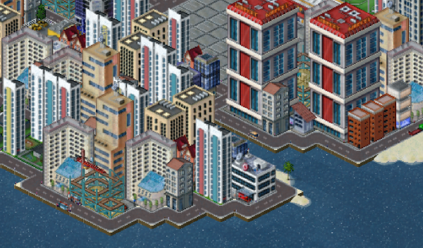

As you know TheoTown is a pixel graphics game and we don't want nor can modify graphics manually to look cartoonish. Here's where the shader comes into play: We can use it to get a cartoony look by applying an algorithm to the graphics in realtime during redendering.

Some ingredients for a cartoon shader:

* Edge detection to highlight edges - This is the most important thing for a cartoony look
* Smoothing - In most cases we want to smooth the non edge parts a bit
* Frame type detection - So we can apply the shader to specific _things_ (i.e. we don't want to apply it to UI or text)

All of these steps must be implemented in the fragment shader as we want to apply these to individual fragments / pixels. The following steps will build up from the default shader codes.

### Edge detection
You may have heard of the so called [Sobel operator](https://de.wikipedia.org/wiki/Sobel-Operator) which can be used to calculate edges for any pixel of an image based on its neighboring 8 pixel colors. This is an option, however, we certainly do not want to sample all 8 neighboring pixels because that's quite expensive (in fact, texture lookups are probably the most computationally expensive operation in fragment shaders and you should reduce them as much as possible). Instead, we can e.g. use the left and upper neighbor pixel colors and compare them to the center, only.

Code-wise this may look like this:

```glsl
vec4 col = texture2D(texture, texCoord);
vec4 leftCol = texture2D(texture, texCoord + vec2(-dUnit, 0.0));
vec4 upCol = texture2D(texture, texCoord + vec2(0.0, -dUnit));
vec4 diff = abs(col - leftCol) + abs(col - upCol);
float edge = length(diff);
```

The dUnit variable is a uniform float value that contains the distance between two pixels in the world texture in UV-Coordinates. It's effectively 1 / size of the world texture. We can use it to calculate the locations of the neighboring pixels for the lookups. When we visualize these edges it looks like this:

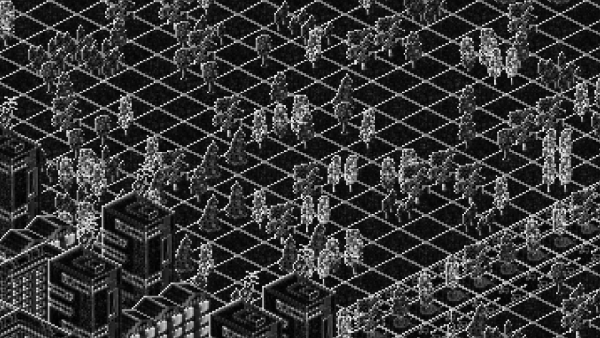

As you can see this filter also detect edges in regions with noise like on the trees. Furthermore, since we only compare the center pixel to the left and upper neighboring pixels, we cannot show edges to transparency on the right or bottom side of buildings (as these pixels will be transparent as well).

So we _may_ need to sample two more neighbors after all:
```glsl
vec4 center = texture2D(texture, texCoord);
vec4 leftCol = texture2D(texture, texCoord + vec2(-dUnit, 0.0));
vec4 upCol = texture2D(texture, texCoord + vec2(0.0, -dUnit));
vec4 rightCol = texture2D(texture, texCoord + vec2(dUnit, 0.0));
vec4 downCol = texture2D(texture, texCoord + vec2(0.0, dUnit));

vec4 diff = abs(rightCol - leftCol) + abs(downCol - upCol);
diff.a *= 2.0;
float edge = pow(0.4 * length(diff), 2.0);
```

Here I also did some math on the edge value for better results. I consider this quite usable:

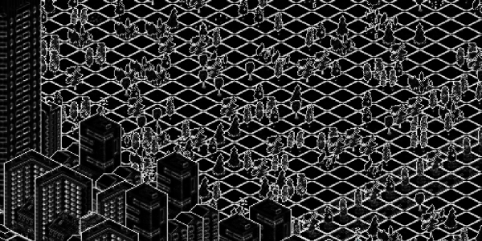

Let's slab that edge onto the pixel color using:

```
glsl
vec4 col = vec4(center.rgb - vec3(edge * center.a), center.a);
```

and watch this beauty:

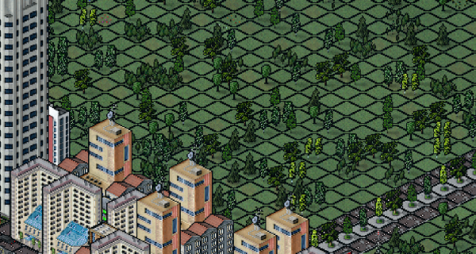

You may notice that some edges like the ones on the ground are way too prominent. We'll fix this later.

### Smoothing
TheoTown uses a lot of _noise_ to convey details in its pixels. This is intended but does not fit with a cartoony look. The easiest way to get a smoothed pixel color is to take the average color of all 5 previously sampled pixels:

```glsl
vec4 col = 0.2 * (leftCol + upCol + rightCol + downCol + center);
```

This way we get this:

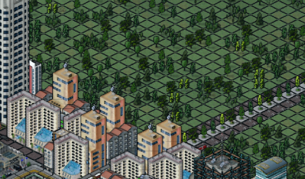

There's definitely some smoothing involved here. However, look at these strange lines above the buildings. Since our shader does not care about frame boundaries (i.e. the boundaries of the drawn images) surrounding non transparent areas of the world texture can _bleed_ in.

So how do we fix this? One approach is to multiply the color of neighboring pixels by the center alpha value and to ensure that the center alpha will also be the overall resulting transparency of the fragment:

```glsl
vec4 col = ((leftCol + upCol + rightCol + downCol) * center.a + 2.0 * center) / 6.0;
col = vec4(col.rgb * center.a, center.a);
```

So now we have some nice smoothing without strange lines:

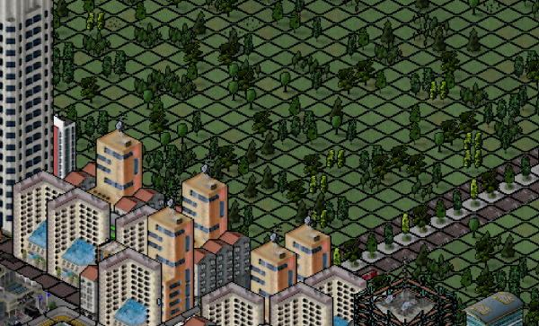

Now the edges to transparency are especially pronounced. This would even be the case if we'd set the edge value to 0.0. The reason for this is pre-multiplied alpha which we have to consider to smooth somewhat correctly. Although not especially important in this context, as we want to draw edges anyway, a more correct code looks like this:

```glsl
col = ((leftCol + upCol + rightCol + downCol) + 2.0 * center) / (2.0 * center.a + leftCol.a + upCol.a + rightCol.a + downCol.a);
col = vec4(col.rgb * center.a, center.a);
```

### Frame type detection

It's time to fix the way too prominent lines on the ground. Not only that, look what the shader in its current form does to our UI.


A bit of a background story: Normally, games are rendered using multiple shaders for different parts of the game. As switching between shaders is usually expensive a depth (or z-)buffer is used to be able to draw things out of order without sorting issues. However, for simplicity only one shader is used in TheoTown to draw everything. Furthermore, there's no depth buffer as it's not needed when being able to just "draw things from back to front". As a result. our shader will not only be used for rendering the city but also for rendering UI, text, overlays etc. This is sufficient for the game's built-in shaders, but as shown above we need a way to detect which type of frame we are rendering right now.

For that, we can ask the game to provide us with a frame type identifier that will be associated with each vertex (so it's a vertex attribute). In the vertex shader we have to define it as:

```glsl
attribute float vType;
```

To tell the fragment shader the frame type we have to introduce a varying variable that we fill with the content of vType in the vertex shader's main function:

```glsl
...
varying lowp float type;
...
void main() {
  ...
  type = vType;
}
```

The vType attribute will contain the same integer value for all vertices of a quad. We still have to use the float datatype for it for compatibility reasons.

The next step is to "receive" the frame type in the fragment shader. For that we have to define the same varying variable in the fragment shader:

```glsl
varying lowp float type;
```

Now as we have the type variable we can start using it in the main function of the fragment shader. We don't want to apply the cartoony look to UI, text, weather, overlay and background frames. For that we can use a if condition and some built-in constants:
```glsl
vec4 center = texture2D(texture, texCoord);
vec4 col = center;

if (type != TYPE_UI
        && type != TYPE_TEXT
        && type != TYPE_WEATHER
        && type != TYPE_OVERLAY
        && type != TYPE_GROUND_BACKGROUND) {
    vec4 leftCol = texture2D(texture, texCoord + vec2(-dUnit, 0.0));
    vec4 upCol = texture2D(texture, texCoord + vec2(0.0, -dUnit));
    vec4 rightCol = texture2D(texture, texCoord + vec2(dUnit, 0.0));
    vec4 downCol = texture2D(texture, texCoord + vec2(0.0, dUnit));

    vec4 diff = abs(rightCol - leftCol) + abs(downCol - upCol);
    diff.a *= 2.0;
    float edge = pow(0.4 * length(diff), 2.0);

    col = 0.2 * ((leftCol + upCol + rightCol + downCol) * center.a + center);
    col = vec4(col.rgb * center.a, center.a);
    col = vec4(col.rgb - vec3(edge * col.a), col.a);
}
...
```

This already fixes most issues:

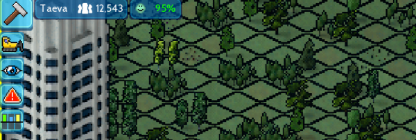

Let's tweak the edges dependent on frame type:
```glsl
if (type >= TYPE_GROUND_LAND && type <= TYPE_REGION_EDGE || type == TYPE_ROAD) {
	edge *= 0.01;
}
```
We can use <= and >= to check the frame type against ranges as they are guaranteed to be defined in the order they'll be listed in the next post. Some more tweaking and we get this:

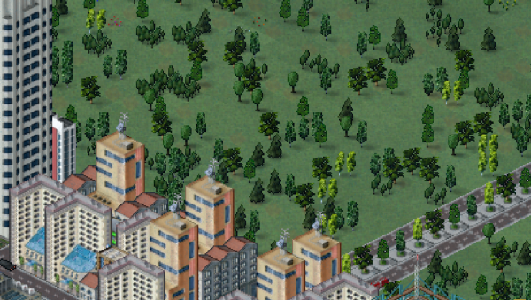

On a side-note: Branching (i.e. if conditions) in shader code should usually be avoided. In contrast to code running on a CPU all GPU threads within a thread pool share a program counter. This means that even if only a single thread will branch into some extra code, the execution time will behave as if all threads entered that code section. In the context of type dependent shader effects I don't think there's a viable alternative. Just so you know.

I'll call it a day from here. Feel free to tweak the shader yourself. I'd be glad to see your modifications
[here in the showcase](https://forum.theotown.com/viewforum.php?f=125) or in the store. </br>
[:material-file-download: tutorial_cartoon_shader.zip](../../assets/guides/custom-shaders/tutorial_cartoon_shader.zip)

## 6. Other useful uniforms and vertex attributes

### Uniforms
Uniforms are global values that can be provided by the environment. The following built-in uniform values can be used:


```glsl
uniform vec2 viewport;  // Viewport size (2,2) divided by target render resolution
uniform vec2 offset;    // Render offset in pixel screen space
uniform sampler2D texture;  // The texture to sample colors from
uniform float saturation;   // Saturation with 0 being grayscale and 1 being normal
uniform float units;    // Deprecated: Amount of textures bound to the sampler; result is always 1 for recent versions of the game

uniform float unit;   // Pixel size of the texture; deprecated as it works on square textures, only
uniform float dUnit;  // 1 divided by pixel size of the texture; can be used to sample with pixel precision from the texture; deprecated as it works on square textures, only
uniform vec2 unit2;   // Pixel width and height of the texture (new in 1.11.27)
uniform vec2 dUnit2;  // 1 divided by pixel width, height of the texture; can be used to sample with pixel precision from the texture (new in 1.11.27)

uniform float time;       // Time in seconds, always positive, restarts after a while, can be used to animate stuff
uniform float cityScale;  // Current scaling of the drawn city
uniform float cityTime;   // City speed dependent animation time
```

You can define your own uniform values using the
[`Drawing.setUniform`](https://doc.theotown.com/modules/Drawing.html#setUniform)
function in Lua.


### Vertex attributes
These attributes describe the type of information that is available per vertex. The defined attributes in the vertex shader will be filled with the respective values automatically. You cannot access vertex attributes in the fragment shader directly but will have to use varyings to pass them from the vertex shader to the fragment shader as shown in the example above.

```glsl
attribute vec2 vVertex;    // Pixel screen space position of the vertex
attribute vec4 vColor;     // Color of the vertex using (r,g,b,a) format and normalized values
attribute highp vec2 vTexCoord;     // Tex coord of the vertex (u,v)
attribute float vType;     // Type of the frame that belongs to the vertex; will be the same for all vertices of a quad
attribute vec2 vQuadCoord; // The local coordinates of the vertex within the quad top left=(0,0), top right=(1,0), bottom left=(1,1), bottom right=(0,1)
```

### Constants

Constants are fixed values that will be injected into your shader code by the game before it gets compiled. Right now all constants are frame type related and can be used to detect the type of the currently drawn image / quad / triangle / fragment. Frame types are represented by integer float numbers that ascend in the order of this listing.

- TYPE_NULL
- TYPE_UI
- TYPE_TEXT
- TYPE_GROUND_LAND
- TYPE_GROUND_WATER
- TYPE_GROUND_BACKGROUND
- TYPE_GROUND_EDGE
- TYPE_REGION
- TYPE_REGION_EDGE
- TYPE_TOOL
- TYPE_ZONE
- TYPE_TREE
- TYPE_BUILDING
- TYPE_ROAD
- TYPE_ROAD_DECO
- TYPE_ROAD_OCCUPATION
- TYPE_BUS_STOP
- TYPE_WIRE
- TYPE_PIPE
- TYPE_RAIL
- TYPE_CAR
- TYPE_TRAIN
- TYPE_FLYING_OBJECT
- TYPE_PEDESTRIAN
- TYPE_WEATHER
- TYPE_OVERLAY
- TYPE_FENCE (new in 1.10.95)

## 7. Waving tree shader example

Here's an example of how a waving trees shader could be implemented making use of the local quad coords vertex attribute vQuadCoord.

**vertex.src**:
```glsl
attribute vec2 vVertex;
attribute vec4 vColor;
attribute highp vec2 vTexCoord;
attribute float vType;
attribute vec2 vQuadCoord;

uniform vec2 viewport;
uniform vec2 offset;

uniform float cityTime;
uniform float cityScale;

varying highp vec2 texCoord;
varying lowp vec4 vertexColor;

void main() {
	vec2 myOffset = vec2(0.0);
	if (vType == TYPE_TREE && vQuadCoord.y == 0.0) {
		float pseudoRandom = vTexCoord.x * 1337.0 + vTexCoord.y * 2487.0;
		myOffset.x = 4.0 * cityScale * cos(cityTime + pseudoRandom);
	}

	texCoord = vTexCoord;
	vertexColor = vColor;
	gl_Position = vec4((vVertex + offset + myOffset) * viewport + vec2(-1.0, 1.0), 0.0, 1.0);
}
```

**fragment.src**:
```glsl
precision lowp float;

uniform sampler2D texture;
uniform float saturation;

varying highp vec2 texCoord;
varying lowp vec4 vertexColor;

void main() {
	vec4 col = texture2D(texture, texCoord);
	col *= vertexColor;

	float light = (col.x + col.y + col.z) * 0.333333;
	col = vec4(saturation * (col.xyz - vec3(light)) + vec3(light), col.a);

	gl_FragColor = col;
}
```

<sub>
This page has been adapted from
[a topic](https://forum.theotown.com/viewtopic.php?t=16838)
on the official TheoTown forum.
</sub>
