# A better visual guide on shading, shadows and detail

!!! info
    This is an updated visual guide on shading, shadows, depth and noise.
    To find the old version, click [**here**](https://forum.theotown.com/viewtopic.php?t=13798).

This visual guide covers
^^shading, shadows, depth (windows, parapet), noise, roof and ambient occlusions^^
in a visual manner.
This guide contains some text, however, you should be able to understand most stuff
from just looking at the images.
A compiled version of the guide (in one image, no text) can be found at the bottom of this tutorial.

## Part 1: Shading

Light in TheoTown comes from the ^^left^^ side. This means that the left side will be lighter, while the right side will be darker.

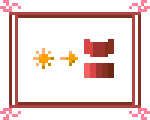

This rule must be applied when making structures. Adding outlines to walls will ruin the quality of your plugin.

However, one of the most important factors of quality will be your implementation of ^^contrast^^.
Generally, the higher contrast can be achieved by making darker (decreasing the value, V) colors brighter
(increasing the saturation, S) and closer to the
blue (#0000FF; hue, or H = 240,
why darker colors are closer to blue is explained in the second part.) color.

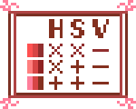

By tinkering with the HSV values, higher contrast will be achieved, making structures look less dull.

Applying the HSV rule, this is how our structure looks now.

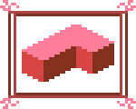

## Part 2: Shadows

As mentioned in Part 1, light comes from the left side. Therefore, any shadows will be going diagonally to the ^^right^^.

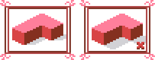

Shadow lengths are usually equal to drawing a 45 degree line from the top of a structure to the bottom.

It is important to note that shadows also affect walls. However, it is important that you do not make them too long.

Another important thing: shadows are slightly blue in color, which is why darker areas (see HSV in Part 1) are closer in color to blue.

One final thing: shadows look better when they fade out rather than disappear instantly. This is how our structure looks now.

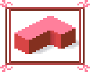

## Part 3: Windows and depth

When adding windows, it is recommended you add windowsills which create more depth to your buildings, making them look nicer.

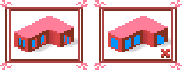

Bright blue windows are to be avoided. It is suggested you go much darker with window colors, pure black (#000000) is also acceptable.

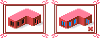

When making windowsills, you can color the vertical side in the other side's color, while the horizontal side can be the color of the flat roof. Make sure to mind the shadows. This (left) is how our structure looks now.

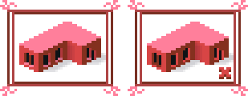

As a bonus, if you want to keep the roof flat, you may want to add a **parapet** to make your building more realistic. Mind the shadows.

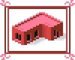

## Part 4: Noise

Adding noise to a structure gives a sense of texture, which alleviates the issue of your structure looking flat and plastic. Noise can be achieved by making random pixels lighter or darker.

Noise can be done by tools. However, make sure you do not overdo it.

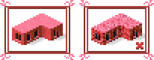

Noise can also be made manually, like I did by making pixels darker in "crack" formations. The advantage to creating noise manually is that you have better control over which algorithm you want to use and what texture you want to convey. However, doing so is slower and takes more effort. This is how our structure looks now.

## Part 5: Roof

Roofs come in all shapes and sizes, however, you are most likely to use one of either these roof shapes. The numbers show how much you should raise a pixel (draw it higher vertically) for each horizontal pixel. As mentioned in Part 3, completely flat roofs are also a possibility; it is recommended to add a parapet in that case.

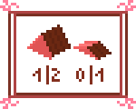

Applying the 1/2 roof to the building gives this:

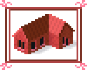

Add shadows and noise to the roof, and this is how our structure looks now.

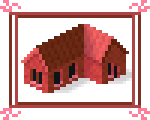

## Part 6: Ambient occlusions

Ambient occlusions help making walls stand out more. They are achieved by adding dark transparent pixels (I use the same color as shadows) to corners and edges.

Add ambient occlusions, and this is how our finished structure looks now.

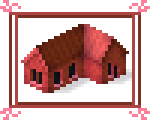

## Finale

Applying all the given tricks to your plugins can make them look much more pleasant and raises the likelihood that your plugin will be approved if you upload it to the Plugin Store, if you choose better colors. Please note that you should first get done with the structure and then add noise, ambient occlusions and shadows.

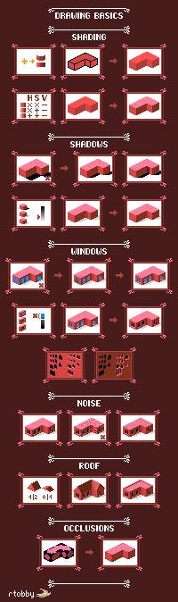

This page has been adapted from
[a topic](https://forum.theotown.com/viewtopic.php?t=25943)
on the official TheoTown forum.

