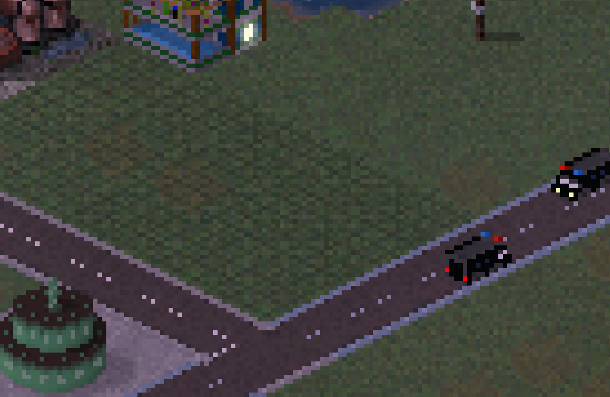

# Ground decals

!!! info "Added in version 1.9.75"

You can define a "level 2" ground. This is basically an overlay for ground and can be used for decals.
These will be unchanged if a building it built on them:

{: style="width:100%;"}

In contrast to other ground plugins all we need is to specify `"level": 1` (that is the second level considering level 0 as default) and a frame:
```json
[
  {
    "id":"$ground2test00",
    "type":"ground",
    "level":1,
    "frames":[{"bmp":"ground.png"}]
  }
]
```

{: style="background-color:grey;width:25%;"}

As of right now, only levels 0 and 1 are supported.

<sub>
This page has been adapted from
[a topic](https://forum.theotown.com/viewtopic.php?t=13353)
on the official TheoTown forum.
</sub>
