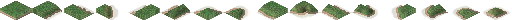
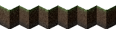
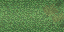

# Ground/terrain/asphalt

Drafts of type `ground` can be used to add other ground type to the existing grass, sand, asphalt and so on.

```json
[{
  "id": "$myground00",
  "type": "ground",
  "frames": [{"bmp": "frames.png", "w": 32, "count": 6}],
  "border frames": [{"bmp": "border_frames.png", "w": 32, "handle y": 8,"count": 16}],
  "edge frames": [{"bmp": "edge_frames.png", "w": 16, "count": 12}],
  "edge border frames": [{"bmp": "edge_border_frames.png", "w": 16, "count": 32}],
  "texture": [{"bmp": "texture.png", "w": 32, "count": 2}]
}]
```


**frames** </br>
These frames are used for the (flat) surface of the ground. By providing multiple frames you can add some variation.


**border frames** </br>
These frames are used for coasts, that is, where a neighbouring tile is water. The order is important and works similar to the alignment of road frames.




**edge frames** </br>
Edge frames are used for the edges of the map.




**edge border frames** </br>
Edge border frames are used for tiles at the edge of the map that are also coast.


**texture** </br>
These optional 2 frames are used for drawing slopes. Providing them is useful for better looking slopes since otherwise the game tries to use the regular **frames** for slope drawing.




Instead of **edge frames** and **edge border frames** you can use `"template":"$template_ground"` to use the game's default ones.

You can provide winter frames by adding `" winter"` suffix to the key of a frames attribute. E.g. `"frames winter": [...]` would be used to define winter frames. The amount of winter frames provided should match the defined amount of regular frames.

You can also define the color that will be used for the ground in the minimap:
```json
"map color": {"r": 68, "g": 96, "b": 48},
"map color winter": {"r": 239, "g": 239, "b": 239}
```

These would be the colors that are used by default.

You can use ground for example as [ground under buildings](ground-tiles.md).

<sub>
This page has been adapted from
[a topic](https://forum.theotown.com/viewtopic.php?t=12176)
on the official TheoTown forum.
</sub>
