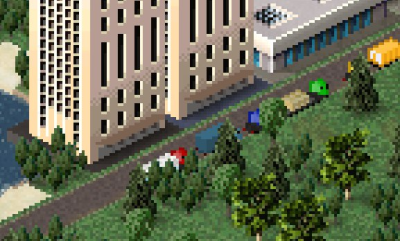

# Ground tiles under buildings

!!! info "Added in version 1.8.58"

Update 1.8.58 added a new feature to JSON called "ground tiles".

This will _randomly_ select one ground tile in the given array and build it under the building.
So for example, you want to make a building that has asphalt as it's ground you would simply add this line of JSON: 
```json
"ground tiles": ["$asphalt00", "$asphalt01", "$asphalt02"]
```

{: style="width:100%;"}

Also by adding a wide variety of grounds your building won't look too repetitive.
You could also **save plugin space** by using this method if you use a _variety of ground tiles for a variety of buildings_.

$\text{space} = \text{grounds} + \text{buildings}$<br/>
Space you use when using the ground tile method (new method)

$\text{space} = \text{grounds} \cdot \text{buildings}$<br/>
Space you use adding the ground individually to each building (old method)

Make sure you do some _quick maths_ since the ground tile method won't always save plugin space!

**1 ground frame, 3 buildings**

- new method: 3 + 1 = 4  <-- _uses <span style="color:#BF0000">more</span> plugin space_
- old method: 3 * 1 = 3

**3 ground frames, 4 buildings**

- new method: 3 + 4 = 7  <-- _uses <span style="color:#40BF00">less</span> plugin space_
- old method: 3 * 4 = 12

This is an example of how you would implement it in your JSON:
```json
[
  // old method
  {
    "id": "$ground_tile_example",
    ...
    "random frames": true,
    "frames": [
        {"bmp": "$example_building00"},
        {"bmp": "$example_building01"},
        {"bmp": "$example_building02"}
    ]
  },

  // new method
  // this makes it more concise, yet much more readable
  {
    "id": "$ground_tile_example",
    ...
    "draw ground": true,
    "frames": [{"bmp": "$example_building"}],
    "ground tiles": [ "$example_tile00", "$example_tile01", "$example_tile02" ]
  }
]
```

<sub>
This page has been adapted from
[a topic](https://forum.theotown.com/viewtopic.php?t=11487)
on the official TheoTown forum.
</sub>
