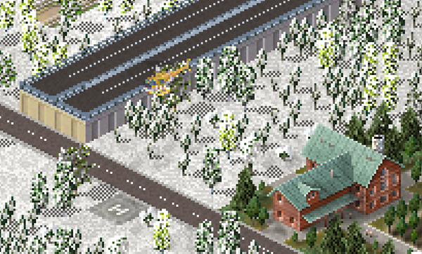

# Helicopters

{: style="width:100%;"}

Game allows you to define custom helicopters. Their definition is quite simple as everything you need are frames for the heli. For example these:


Each has a size of 38x18. The helicopter definition looks now like:
```json
{
  "id": "$my_heli00",
  "type": "helicopter",
  "frames": [
    // 4 frames for the helicopter, handle defined the pivot point
    {"bmp": "heli.png", "w": 38, "h": 18, "count": 4, "handle x": 18, "handle y": 16}
  ], 
  "animation": [{"id": "$rotor00", "x": 0, "y": -10}]
}
```

Notice how it uses a predefined animation called "$rotor00". It just contains 8 frames, 4 for slow rotation, 4 for fast rotation. In most cases you won't need to come up with your own rotor frames.

For reference it's defined like so:
```json
{
  "id": "$rotor00",
  "type": "animation",
  "frames": [
    {"x": 360, "y":526, "w": 38, "h": 9, "count": 4, "handle x": 18, "handle y": 5},
    {"x": 360, "y":512, "w": 38, "h": 13, "count": 4, "handle x": 18, "handle y": 6}
  ]
}
```

For the helicopter spawner let's define a decoration tile:


Its code contains the helicopter spawner:
```json
{
  "id": "$heliplaza00",
  "type": "decoration",
  "width": 1,
  "height": 1,
  "frames": [{"bmp": "heliport.png"}],
  "build height": 0,  // Ensure correct building height so that helicopter will start at right height (zero = ground level)
  // Helicopter spawner object
  "helicopter spawner": {  
    "id": "$my_heli00", // ID of the helicopter to spawn
    "radius": 16        // Radius where they helicopter will fly randomly. Is 16 by default
  }
}
```

!!! warning "Warning"
    The helicopter ID provided in a helicopter spawner doesn't have to be defined yet. However, if it's still not defined when the game tries to use it, it will crash.

<sub>
This page has been adapted from
[a topic](https://forum.theotown.com/viewtopic.php?t=5249)
on the official TheoTown forum.
</sub>
