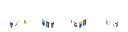

# Lights and night animations


!!! info
    Before starting, it is recommended that you to check out the [animation guide](animations.md).
    Best results with help of _paint.net_.

Night light definitions are practically the same thing as animations. They are defined the same way as animations, but have a few additional attributes. These attributes are:
```json
"light": true // or false
```

This makes sure the animation lights up and doesn't get darker at night. ^^It should be always true if you are defining night definitions.^^ **False** by default.

and
```json
"light switching": true // or false
```
which makes the animation show up all the time (false) or only at night (true). If you are adding window lights to your building you should set this on **true**.

That's pretty much everything. If you want to append your night definitions to your buildings you should follow the default animation guide.
A list of in-game night definitions will follow later (probably), see lower.

## Custom animations

Your buildings will probably use mostly in-game night definitions.
However, you can add your custom ones that fit the game style if the shape you're looking for is unavailable.
The default window light animation color is **FFFBE5** and a gaussian blur of around 4 (_paint.net_ value).

## Tool for aligning animations easier

Counting x and y coordinates for each window might be tiring and take a lot of time.
The easiest and most user-friendly solution is to use
**ian's** [Animation Dev Tool](https://forum.theotown.com/viewtopic.php?f=115&t=12453).
This plugin will allow you to create huge animation arrays quickly and effortlessly.
No in-depth animation knowledge needed!

You can also use this tool to fetch in-game night definitions for manual animations. Good luck! :)

## Video tutorial by FVI

<iframe width="560" height="315" src="https://www.youtube.com/embed/1LzUVtXNfsQ?si=BC1nOHVbPbSuipr_" title="YouTube video player" frameborder="0" allow="accelerometer; autoplay; clipboard-write; encrypted-media; gyroscope; picture-in-picture; web-share" referrerpolicy="strict-origin-when-cross-origin" allowfullscreen></iframe>

```json
[
  {
    "id": "$nightanimation123",
    "type": "animation",
    "light": true,
    "light switching": true,
    "frames": [{
      "bmp": "HTHLM1.png",
      "count": 1,
      "h": 32,
      "w": 32
    }],
    "rotation aware": false
  },
  {
    "type": "residential",
    "id": "$greenhalftimbredhouse",
    "text": "A house", 
    "author": "FVI",
    "ordinal": 1,
    "meta": {"pca": {
      "version": "4.0.3"
    }},
    "frames": [{
      "bmp": "HTH5.png"
    }],
    "width": 1,
    "height": 1,
    "needs road": false,
    "draw ground": true, 
    "animation": [{"id": "$nightanimation123", "x": 0,"y": -25}]
  }
]
```

## Rotation aware night animations

As you may know, rotation aware buildings require to have frames that are multiples of 2 or 4. The same applies for rotation aware light animations too. Otherwise, you might not get the expected result.

Let's assume we have these shining graphics for the building itself and the animation (made by THEMAX):




Then our JSON will look like so:
```json
[
  {
    "id": "$Themax_example_kiosk_night",
    "type": "animation",
    "light": true,
    "light switching": true,
    "frames": [
      {
        "bmp": "night.png",
        "count": 4,
        "h": 32,
        "w": 32
      }
    ],
    "rotation aware": true
  },
  {
    "id": "$Themax_example_kiosk",
    "type": "decoration",
    "author": "Themax",
    "width": 1,
    "height": 1,
    "frames": [
      {
        "bmp": "normal.png",
        "count": 4,
        "h": 32,
        "w": 32
      }
    ],
    "animation": [{"id": "$Themax_example_kiosk_night", "x":0,"y":-25}],
    "rotation aware": true,
    "draw ground": true,
    "needs road": false,
    "text": "A newspaper kiosk based on those you can find in Paris.",
    "title": "Paris newspaper kiosk"
  }
]
```

Here is our JSON, first we define a night-animation draft, and set up a single frame sheet with `"count"`, `"h"` and `"w"` corresponding to the total width of the frame divided by 4. Alternatively, you can just provide 4 separate frames. Most importantly, we add a `"rotation aware": true` (mandatory, otherwise it won't work).

Once that's done, reference the animation from the building and you should be good to go, adjust the `"y"` part accordingly so it matches your texture. 

There we go, now we have a working rotation aware building with rotation aware functionality. You may also use `"frame": index` in your animation object for greater control and other attributes as documented by the animation attribute object and the draft.

<sub>
This page has been adapted from
[topics](https://forum.theotown.com/viewforum.php?f=41)
that are on the official TheoTown forum.
</sub>
