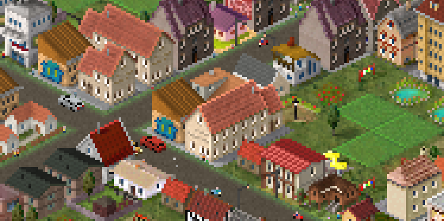
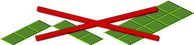
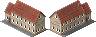

# Non square buildings

!!! info "Added in version 1.12.26"

{: style="width:100%;"}

Update 1.12.26 has brought support for buildings with non square base plate.

For example buildings that use the following templates work now without the need to use [composition buildings](compositions.md):
{: style="width:100%;image-rendering:crisp-edges;"}
(sizes from left to right: 1x2, 2x1, 2x3, 2x4)

Usable templates can be found on [the templates page](https://forum.theotown.com/viewtopic.php?t=3207).

## Requirements and Caveats
Non square buildings **must provide** at least two frames as they are rotation aware.

The game has to render non square buildings multiple times. For now, this is limited to drawing it two times at max. As a result, the ratio between width and height must be 2 at max. For example, the following formats are not supported:
{: style="width:100%;image-rendering:crisp-edges;"}
(1x3, 3x1, 2x5)

While non square buildings do support RCI auto spawning, they may not actually spawn in some constraint space conditions.

## Example
Here's an example non square building with a size of 2x1 (the size refers to the size of the first frame):

```json
[
  {
    "id": "$res_nonsquare00",
    "type": "residential",
    "level": 1,
    "width": 2,
    "height": 1,
    "frames": [
      {"bmp": "res.png", "w": 48, "count": 2}
    ]
  }
]
```
{: style="width:100%;image-rendering:crisp-edges;"}

<sub>
This page has been adapted from
[a topic](https://forum.theotown.com/viewtopic.php?t=28150)
on the official TheoTown forum.
</sub>
