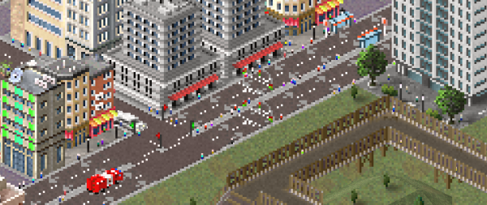
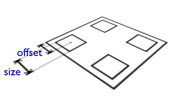

# Pedestrians

!!! info "Added in version 1.10.15"

{: style="width:100%;"}

## Design aspects
In order to incorporate pedestrians into the game multiple aspects had to be considered:

1. Roads should act as unit on which pedestrians are walking
2. Existing plugins that use pedestrian road type should work with the new system as well
3. Setting pedestrian flag automatically for roads would break these plugins (special "pedestrian cars" would use normal roads then)
4. In any case, there has to be a way to detect whether a road is suitable for pedestrians, potentially with additional support for different types of pedestrians which could be implemented by using road flags

The solution to these requirements was to add a new attribute **pedestrians** to roads. If not specified the game will try to figure out whether the road is capable to be used by pedestrians.

Pedestrians themselves were implemented using a new draft type called **pedestrian**. This plugin type basically consists of some frames that contain the people that will be drawn. These frames are special in regard to their size as people in TheoTown are supposed to have a size of 1x3 pixels. While other sizes may work, too, there is no rotational awareness for the frames. Furthermore, the pedestrian system was optimized around the idea that people have a width of exactly one pixel. Using different sizes may cause more graphical glitches. 

## Defining pedestrians
A new plugin type "pedestrian" was added to define pedestrians. Here's how a plugin may look like:
```json
[
  {
    "id":"$pedestrian_plugin00",
    "type":"pedestrian",
    "frames":[{"bmp": "imgage.png", "w": 1, "count": 8}]
  }
]
```
using an image like that:

{: style="width:25%;image-rendering:crisp-edges;"}

This pedestrian type would spawn automatically for all rci types and levels in the game. You can define how likely the pedestrian will spawn for certain types/levels using the following attributes:

- **residential**
- **commercial**
- **industrial**
- **level 1**
- **level 2**
- **level 3**

These are expected to be floating point numbers. The default value for all of them is 1. Use **"auto spawn": false** to set the default value to 0.

## Roads



A single road tile offers four parcels which can be targeted by pedestrians.
Various attributes were added to roads to incorporate the pedestrian system and provide some control over its behavior:
### pedestrians
>
Set this attribute to true or false. Pedestrians can walk on this road only if this attribute was set to true.
>
If not specified the game will try to determine whether pedestrians are supposed to be able to walk on this road automatically. This is determined by factors like road flags, allow transfer attribute and speed.

### sidewalk offset
>
Distance of the center of the sidewalk to the edges of the road tile (normalized, default value is 0.05).

### sidewalk size
>
Size/width of the sidewalk (normalized, default value is 0.025).

### allow road crossing
>
If set to true pedestrians will be able to cross the road. Only useful for roads without or with slow traffic.
>
If not set the game will determine this attribute based on the sidewalk offset.


## Road decorations
Road decorations have the ability to set allow road crossing to true for the road they are placed on.

### allow road crossing
>
If set to true pedestrians will be able to cross the road underneath the decoration. False by default.


## Spawning pedestrians
The game will spawn pedestrians automatically on roads that are suitable.

Unlike cars pedestrians don't follow a pre-calculated path. Instead they randomly change direction and eventually vanish. Also, unlike cars, only pedestrians that are currently within the viewport will be updated. This is crucial to maintain game performance while there are thousands of pedestrians.


## Interaction with pedestrians
As of right now there are no functions to interact with the pedestrian system directly. Even if something like that will be added (e.g. pedestrians walking to/from stations) it would not have impact on the simulation of the city as only visible pedestrians will be updated.

<sub>
This page has been adapted from
[a topic](https://forum.theotown.com/viewtopic.php?t=14155)
on the official TheoTown forum.
</sub>