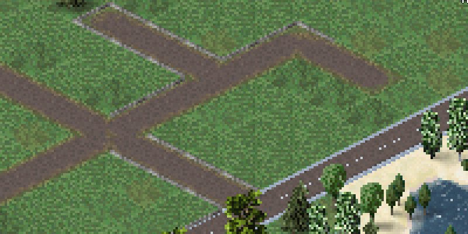

# Road decorations

Since 1.4.75 there is a new type of object in the game: Road decorations.
Those are basically road alignment aware frames that can be attached on top of any road, similar to [animations that are defined directly by a road](https://theotown.com/forum/viewtopic.php?p=43236#p43236).

How it may look like:

This one is simple for the purpose of demonstration. We're confident that you can come up with something that is way better.

The frame we want to use as decoration:


The usage is supposed to follow this scheme:


The basic structure of road decorations is to define all the needed frames as animation objects which can then be referenced in the road decoration object. So here they may look like:
```json
{"id": "$anim_roaddeco_sample00_00", "type": "animation", "frames": [{"bmp":"frames.png","x":0,"w":32,"handle y":8}]},
{"id": "$anim_roaddeco_sample00_01", "type": "animation", "frames": [{"bmp":"frames.png","x":32,"w":32,"handle y":8}]},
{"id": "$anim_roaddeco_sample00_02", "type": "animation", "frames": [{"bmp":"frames.png","x":64,"w":32,"handle y":8}]},
{"id": "$anim_roaddeco_sample00_03", "type": "animation", "frames": [{"bmp":"frames.png","x":96,"w":32,"handle y":8}]}
```

!!! note

    Although we're talking about animation objects they aren't animated here because each animation has only one frame.

So now we have 4 animation objects that hold our frames that we want to put on top of roads. The basic road decoration structure looks like:
```json
{
  "id": "$roaddeco_sample00",
  "type": "road decoration",
  "title": "Sample deco",
  "text": "I am a road decoration.",
  "price": 100,
  ...
}
```
For drawing frames 1 and 3 should be used in the foreground while frames 0 and 2 should be drawn behind cars. We can say so by using **animation** and **animation fg** attributes respectively in the road decoration object:
```json
"animation": [
  {"id": "$anim_roaddeco_sample00_00"},
  {"id": "$anim_roaddeco_sample00_02"}
],
"animation fg": [
  {"id": "$anim_roaddeco_sample00_01"},
  {"id": "$anim_roaddeco_sample00_03"}
]
```
The last part is the most important one: We have to tell the game when to show which animation object. By default, all animations are drawn for every frame (so we don't use frame/alignment awareness yet). Normal roads have 16 frames (as defined [here](https://theotown.com/forum/viewtopic.php?p=43236#p43236)), so we have to tell for each frame manually which of the provided animation objects to use. That can be done by populating the arrays **frame animation indices** and **frame animation fg indices** with 16 sub arrays.
Each of these sub arrays contains a list of the corresponding animation objects that should be used (indexed by 0 and 1 as we have only two animations for **animation** and **animation fg**):
```json
"frame animation indices": [
  [0,1], [0,1], [1], [1],
  [0], [0], [], [],
  [0,1], [0,1], [1], [1],
  [0], [0], [], []
],
"frame animation fg indices": [
  [0,1], [0], [0,1], [0],
  [0,1], [0], [0,1], [0],
  [1], [], [1], [],
  [1], [], [1], []
]
```
Dependent on your project your can just reuse this code and don't have to worry about the meaning.

Here you can get the whole plugin:</br>
[:material-file-download: roaddeco_sample.zip](../assets/guides/road-deco/roaddeco_sample.zip)

Road decoration objects also support the [basic fun attributes](https://theotown.com/forum/viewtopic.php?f=81&t=5016) **fun**, **on click fun** and **random fun**.

Since 1.4.76: The attribute "speed" can be used to apply a speed multiplier to the underlying road. Default value is 1.0


## TheoTown 66 changes
The follow attributes have been added during TheoTown 66 update:

??? note "required flag *"

    You can now use road flags to specify on which roads the decoration should be buildable. The default is
    ```json
    "required flag normal": true
    ```
    which means that it can only be built on regular roads.

    E.g. use
    ```json
    "required flag normal": false,
    "required flag train": true
    ```
    to define a decoration that can only be placed on rails.
    See [this forum thread](https://forum.theotown.com/viewtopic.php?p=30725#30725) for more information about flags.

??? note "min dirs"

    This is basically a filter to limit where the decoration can be built. It states the minimum required amount of connected neighboring roads that's required for the decoration to be built.

    For example:
    ```json
    "min dirs": 1
    ```
    would mean that the decoration cannot be built on roads that aren't connected to any other roads. The default value is 0 meaning that no lower limit is given.

??? note "max dirs"

    Works like min dir but specifies an upper limit of to how many neighboring roads the targeted road has to be connected.

    Example:
    ```json
    "max dirs": 2
    ```
    would mean that the decoration cannot be built on roads with 3 or 4 neighbors. This effectively excludes all kinds of crossings (T crossings have 3 neighbors, X crossings have 4). The default value is 4 meaning that no upper limit is given.

??? note "symmetric dirs"

    This is another filter for road decoration placement. If set to true the road has to be connected to neighboring roads in a symmetric way. This is only the case for not connected roads, a line of road and X crossings.

    For example:
    ```json
    "min dirs": 2,
    "max dirs": 2,
    "symmetric dirs": true
    ```
    only allows the road decoration to be built on a line of road without crossings (using the "min dirs" and "max dirs" attributes to filter out other symmetric cases).

??? note "line tool"

    By default road decorations are built per road tile, now. However, you can enable the line tool by using
    ```json
    "line tool": true
    ```

??? note "enter speed"

    A float value multiplied to the speed of incoming cars. Default value is 1.0

??? note "exit speed"

    A float value multiplied to the speed of outgoing cars. Default value is 1.0

??? note "parcel speeds"

    Similar to the speed attribute, but works on a per tile basis and per parcel basis. Because of that you provide an array of float numbers that will be used as multiplier. If an insufficient number of factors was supplied then numbers will be reused.
    
    For example by only defining 4 factors you could control the speeds for the parcels of all tiles simultaneously. In regard to ordering the first four entries will be used for the four parcels of the first tile and so on. So the following are common amounts of entries for the array:

    - 4 - To set the speeds for the four parcels to the same values for all tiles of the road
    - 64 - To set the parcel speeds of all parcels of all tiles individually
    - 256 - Only needed in case you want to set the speeds of all parcels and all tiles of a one way road individually per one way direction

    The ordering of four parcels is as following:

    - 0 - left
    - 1 - bottom
    - 2 - top
    - 3 - right

    Example:
    ```json
    "parcel speeds": [1, 2, 2, 1]
    ```

## Transport update changes

New attributes since version 1.9.96 (which allows you to enable experimental multi road decorations per road tile in the settings):

??? note "occupation group"

    If support for multiple road decorations per road tile is enabled:

    Specifying a an occupation group will prevent other road decorations of the same group to be present on a road tile at the same time. This can be useful to ensure that only one variant of a group of decorations can be placed at once. E.g. if you have some variants of bush road decorations and only want that one of them can be placed on a road at the same time.

    The ID provided to this attribute is not connected to any existing, prior ID definitions. The default value is the ID of the road decoration draft (so a single decoration can only be placed once on a road tile).

    Usage:
    ```json
    "occupation group": "$somegroupid"
    ```

??? note "exclusive"

    If support for multiple road decorations per road tile is enabled:

    This flag will prevent other road decorations from existing at the same road tile at the same time. It therefore basically disables the new functionality which can be useful if the road decoration is not compatible with it.

    Usage:
    ```json
    "exclusive": true
    ```

<sub>
This page has been adapted from
[a topic](https://forum.theotown.com/viewtopic.php?t=7211)
on the official TheoTown forum.
</sub>