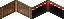

# Road tunnels

See [here](https://forum.theotown.com/viewtopic.php?f=41&t=2964) on how to create road plugins.

To add tunnel support to a road it's sufficient to add the following code to the plugin:
```json
"tunnel frames": [
  {"x": 896, "y": 192, "w": 16, "h":19, "handle y": 7},
  {"x": 912, "y": 192, "w": 16, "h":19, "handle x": -16, "handle y": 7},
  {"x": 928, "y": 192, "w": 16, "h":19, "handle y": 7},
  {"x": 944, "y": 192, "w": 16, "h":19, "handle x": -16, "handle y": 7}
]
```

Tunnels will then use the default tunnel frames (16x19 pixels each):



You may use your own frames. Take care to set the handles of each frame correctly (they are used to position the frame for drawing). This might look like:
```json
"tunnel frames":[
  {"bmp": "tunnel_frames.png", "x": 0, "w": 16, "h": 19, "handle y": 7},
  {"bmp": "tunnel_frames.png", "x": 16, "w": 16, "h": 19, "handle x": -16, "handle y": 7},
  {"bmp": "tunnel_frames.png", "x": 32, "w": 16, "h": 19, "handle y": 7},
  {"bmp": "tunnel_frames.png", "x": 48, "w": 16, "h": 19, "handle x": -16, "handle y": 7}
]
```

<sub>
This page has been adapted from
[a topic](https://forum.theotown.com/viewtopic.php?t=6218)
on the official TheoTown forum.
</sub>