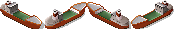

# Ships

Here some graphics:




As always, please give Lobby and theo credit when you reuse it for a plugin. Don't use it outside of TheoTown without permission.

The json looks fairly simple. Use ship as type and provide at least 4 frames. For the yacht it may looks like
```json
[
  {
    "id":"$shipyacht00",
    "type":"ship",
    "frames":[
      {"bmp":"yacht_green.png","w":17,"h":15,"count":4,"handle x":8,"handle y":12},
      {"bmp":"yacht_blue.png","w":17,"h":15,"count":4,"handle x":8,"handle y":12}
    ]
  }
]
```

Here we provide 8 frames, 4 for each variant of the yacht. The game will pick a variant randomly when spawning a ship. Move frames using handle x and handle y until it looks good. Setting them correctly is difficult, so do it by trial and error.

If your ship is longer than one tile use `"length":2` to indicate this.
However, the longer the ship the more likely are graphic issues. That's why the game never added the long container ships.

Spawning ships from a building is fairly simple. It looks similar to car spawning before car spawners were added:

```json
"ships":["$shipyacht00"],
"ship count":4,
"ship radius":16,
```

`ship radius` is currently ignored. Use it for the future.


<sub>
This page has been adapted from
[a topic](https://forum.theotown.com/viewtopic.php?p=43646#p43646)
on the official TheoTown forum.
</sub>
