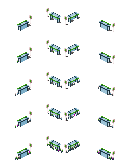

# Bus stops

{: style="width:100%;"}

Bus stops have been a part of TheoTown for a long time. With the [introduction of transportation systems](extending-transportation-systems.md) it's finally time to document them.

In contrast to road decorations, bus stops use a special frame format that makes them rotation aware by default. We must at least provide 4 frames, each 32x32 pixels each:

{: style="width:40%;image-rendering:crisp-edges;"}

Each frame represents the bus stop at a specific location on the road. Dependent on the road the bus stop is placed on the frames to draw will be picked automatically.

You can provide more frames (must be a multiple of 4) to provide more variants. Variants will be used to visualize the usage of the bus stop. The last four frames will be used if the bus stop is currently full etc.

## Example
Let's define a working bus stop that is a bit green and that is compatible with the new transportation system.

{: style="width:40%;image-rendering:crisp-edges;"}

```json
[
  {
    "id": "$my_busstop00",
    "type": "bus stop",
    "title": "My custom bus stop",
    "text": ".",

    "frames": [
      {"bmp": "frames.png", "y": 0, "w": 32, "count": 4},
      {"bmp": "frames.png", "y": 32, "w": 32, "count": 4},
      {"bmp": "frames.png", "y": 64, "w": 32, "count": 4},
      {"bmp": "frames.png", "y": 96, "w": 32, "count": 4}
    ],
    "price": 800,

    // Influence of the bus stop
    "influence passenger bus": 30,

    // Amount of people who can fit in there
    "capacity": 32,

    // The default requirement for bus stops
    "requirements": [{"type": "RANK","lvl": 3}],

    // Make it compatible with transportation system bus stops
    "meta": {"tags": {"default_busstop": {}}}
  }
]
```

## Good to know
There is only a generic preview for bus stops. You can use `"preview frames"` to provide your own icon for use in the toolbar.

By default bus stops get placed into the `"$cat_bus00"` category.

You can use `"required flag *"`, `"min dirs"`, `"max dirs"`, `"symmetric dirs"` as for [road decorations](../road-decorations.md) to limit where a bus stop can be built.

Bus stops can only be built on roads that set the `"allow bus stop": true` flag (implicitly set for roads that define `"flag bus"`.)

<sub>
This page has been adapted from
[a topic](https://forum.theotown.com/viewtopic.php?t=28174)
on the official TheoTown forum.
</sub>
