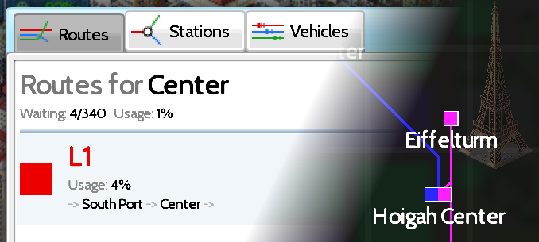
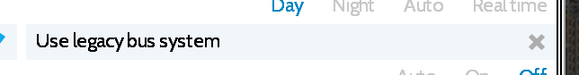

# Extending Transportation Systems

!!! info "Added in version 1.12.26"

{: style="width:100%;"}

The newly introduced transportation update features the following built-in transportation systems:

- Buses
- Passenger Trains
- Freight Trains
- Elevated Train
- Metro

While these modes of transportation existed before the update they now feature the ability to manage routes, stations and vehicles. Even better, you can now extend these systems with more buildings or vehicles via plugins.

## Technical Aspects
These transportation systems all have in common that they are based on roads and cars. Even the elevated train that historically was implemented differently is now based on roads and cars (you didn't notice? great, that means that the automatic migration works.) What this means is that the process of adding new buildings, (bus)stops or vehicles looks quite similar for all systems. The only differences are road flags and tags which are used to assign the objects to the systems. Building types play a minor role in this implementation and were picked as appropriate.

## Vehicles
Vehicles are implemented as [Cars](cars.md). [Car chains](cars.md#car_chains) are supported and can be used to model long buses and trains. So to add a vehicle to a system you first have to implement it as a car.

Add the attributes "capacity" (amount of people that fit into the vehicle) and "speed" (a speed factor, 1 is the default car speed):
```json
"capacity": 20,
"speed": 0.9
```
You can also set a price, but by default the game will set a minimum value based on stats automatically.

After that, add the specifics of the system that you want to target:

- Buses
  ```json
  "flag normal": false,
  "flag bus": true,
  "meta": {"tags": {"ts_normal_bus": {}}}
  ```
- Passenger Trains
  ```json
  "flag normal": false,
  "flag train": true,
  "meta": {"tags": {"short_distance_passenger_train": {}}}
  ```
- Freight Trains
  ```json
  "flag normal": false,
  "flag train": true,
  "meta": {"tags": {"freight_train": {}}}
  ```
- Elevated Train
  ```json
  "flag normal": false,
  "flag elevated train": true,
  "meta": {"tags": {"elevated_train": {}}}
  ```
- Metro
  ```json
  "flag normal": false,
  "flag subway": true,
  "meta": {"tags": {"metro_train": {}}}
  ```

It is crucial to use the correct flags otherwise your cars may not be spawnable.

## Station buildings
Buildings can act as a station in a transportation system. There are two types of station buildings:

- Glue - They don't act as a station on their own but only if a spawn station is nearby; can "glue" nearby buildings together to form a single station; for example used for train stations
- Spawn - The actual building that spawns vehicles. A composited station usually has only a few spawn buildings and many glue buildings

Station buildings can define "capacity". The sum of capacities of all station buildings of a station gets used as its total capacity. The monthly price of a station building gets accounted to the associated transportation system.

- Buses

    As of right now (1.12.27) station buildings are not supported for buses

- Passenger Trains - Glue
  ```json
  "type": "decoration",
  "meta": {"tags": {"passenger_train_platform": {}}}
  ```
- Passenger Trains - Spawn
  ```json
  "type": "railway station",
  "influence passenger train":80,
  "meta": {"tags": {"short_distance_passenger_train_station": {}}}
  ```
- Freight Trains - Glue
  ```json
  "type": "decoration",
  "meta": {"tags": {"passenger_train_platform": {}}}
  ```
- Freight Trains - Spawn
  ```json
  "type": "railway station",
  "influence passenger train":80,
  "meta": {"tags": {"freight_train_station": {}}}
  ```
- Elevated Train - Glue
  ```json
  "type": "railway station",
  "meta": {"tags": {"elevated_train_platform": {}}}
  ```
- Elevated Train - Spawn
  ```json
  "type": "railway station",
  "influence passenger train": 20,
  "car min level": 2,
  "car max level": 2,
  "meta": {"tags": {"elevated_train_station": {}}}
  ```
- Metro - Glue
  ```json
  "type": "railway station",
  "meta": {"tags": {"metro_platform": {}}}
  ```
- Metro - Spawn
  ```json
  "type": "railway station",
  "influence passenger train":25,
  "car min level": -2,
  "car max level": -2,
  "meta": {"tags": {"metro_station": {}}}
  ```

Note how the "influence passenger train" influence gets used as a general influence for public transport. The game internally distinguishes between passenger and freight transport, though.

## (Bus) Stops
[Bus stops](bus-stops.md) are small stops that can be placed directly on "road". From the point of view of the transportation system they are stations. Nearby bus stops will be merged to a single station. Bus stops can define a capacity that is used as the max amount of people that can wait there at a time. Their monthly price will be displayed as spending for the transportation system. As of right now (version 1.12.27) only the following transportation systems support defining bus stops:

- Buses
  ```json
  "influence passenger bus": 30,
  "meta": {"tags": {"default_busstop": {}}}
  ```
- Elevated Train
  ```json
  "influence passenger bus": 30,
  "required flag normal": false,
  "required flag elevated train": true,
  "meta": {"tags": {"elevated_train_busstop": {}}}
  ```

Note that "influence passenger bus" is used to express public transport influence for all of them.

## Depots
The bus and metro transportation system rely on depot buildings that provide space for vehicles. Using the "depot capacity" attribute they define the amount of vehicles that the depot can house.

- Buses
  ```json
  "type": "bus depot",
  "meta": {"tags": {"bus depot": {}}}
  ```
- Metro
  ```json
  "type": "railway station",
  "meta": {"tags": {"metro_depot": {}}}
  ```

Station buildings can be used as depot building for the same transportation system at the same time.

## Roads & Rails
You can define roads and rails as [regular roads](https://forum.theotown.com/viewtopic.php?t=2964) by setting the corresponding flags from the cars above.

## Category & Requirements
For simplicity the default categories and (rank) requirements in the code listings above were omitted. To be consistent with the in-game content you should define requirements so they are _at least_ as strict as the defaults:

- Buses
  ```json
  "category": "$cat_bus00",
  "requirements":[{"type": "RANK", "lvl": 3}]
  ```
- Passenger & Freight Trains
  ```json
  "category": "$cat_train00",
  "requirements": [{"type": "RANK", "lvl": 6}]
  ```
- Elevated Train
  ```json
  "category": "$cat_elevatedtrain00",
  "requirements": [{"type": "RANK", "lvl": 9}]
  ```
- Metro
  ```json
  "category": "$cat_metro00",
  "requirements": [{"type": "RANK", "lvl": 15}]
  ```

## Caveats
{: style="width:100%;"}

The player may disable the new transportation system for buses to keep using the old, level based system. In this case your custom buses won't be used.

You should avoid defining a station building or bus stop for multiple transportation systems at the same time. This would mix up accounting or may lead to incompatible road flags.

<sub>
This page has been adapted from
[a topic](https://forum.theotown.com/viewtopic.php?t=28157)
on the official TheoTown forum.
</sub>
