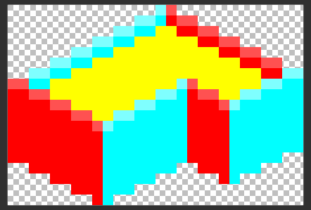

# Using animations to save plugin space 

A very common issue with tall buildings is that they use up a ton of plugin texture space while
having a lot of space and/or repeating floors.
However, this common problem can be circumvented easily, however, the task is fairly tedious.
I will be splitting up the guide into multiple steps to make it more clear.

## Part 1: Drawing the animation
So, let's say we have this building:


It's an eyesore, but accept this as just an example.
As you see, it has a very repeating texture. Now of course, since this building is tall, it will take up a considerable amount of plugin texture space.

Now we will split the building into two parts:

1. The base

    

2. The top

    

The base will always appear at the bottom _once_, while the top is going to be the repeating part.

## Part 2: Defining the animation

This is probably the easiest part!
_Keep in mind that it is IMPORTANT to define the animation and have the building itself in the same file!_

Make sure to remember what ID you used for your animation.
```json
{
  "type": "animation",
  "id": "uniqueid",
  "frames": [{"bmp": "buildingtop.png"}]
}
```

## Part 3: Using the animation

Now by far, the simplest way to use the animation is to just use `ian's Animation Dev Tool.
You still have to define the building itself in your JSON file, however, once you do that,
you'll be able to just find the building itself's ID, and then find your animation's ID and repeat it.
I don't use the tool myself though, so I cannot guarantee an in-depth tutorial on using it.
I'm sure that there are plenty of tutorials on how to use the tool, so make sure to check them out before using it.

If you want to do it yourself, you'll have to use the "animation" attribute to define where and what parts repeat. "id" is for defining which part is used, "x" and "y" are used to define the location of the repeated part.

```json
{
  "animation": [{"id": "uniqueid", "x": 18, "y": -17}],
  "id": "uniqueid1",
  "type": "decoration",
  "width": 2,
  "height": 2,
  "frames": [{"bmp": "buildingbase.png"}],
  "draw ground": true
}
```

I made the base a bit darker to make it easier to differentiate the base from the top.


Since the top floor is 7 pixels tall, I'll add a new animation and lower the Y value by 7.
```json
{
  "animation": [
    {"id": "uniqueid", "x": 18, "y": -17},
    {"id": "uniqueid", "x": 18, "y": -24}
  ],
  "id": "uniqueid2",
  "type": "decoration",
  "width": 2,
  "height": 2,
  "frames": [{"bmp": "buildingbase.png"}],
  "draw ground": true
}
```


```json
{
  "animation": [
    {"id": "uniqueid", "x": 18, "y": -17},
    {"id": "uniqueid", "x": 18, "y": -24},
    {"id": "uniqueid", "x": 18, "y": -31},
    {"id": "uniqueid", "x": 18, "y": -38},
    {"id": "uniqueid", "x": 18, "y": -45},
    {"id": "uniqueid", "x": 18, "y": -52},
    {"id": "uniqueid", "x": 18, "y": -59}
  ],
  "id": "uniqueid3",
  "type": "decoration",
  "width": 2,
  "height": 2,
  "frames": [{"bmp": "buildingbase.png"}],
  "draw ground": true
}
```

And now we have the very tall variant that we wanted!


## Part 4: Concluding the tutorial

Here is the full code:
```json
[
  {
    "type": "animation",
    "id": "uniqueid",
    "frames": [{"bmp": "buildingtop.png"}]
  },
  {
    "animation": [{"id": "uniqueid", "x": 18, "y": -17}],
    "id": "uniqueid1",
    "type": "decoration",
    "width": 2,
    "height": 2,
    "frames": [{"bmp": "buildingbase.png"}],
    "draw ground": true
  },
  {
    "animation": [
      {"id": "uniqueid", "x": 18, "y": -17},
      {"id": "uniqueid", "x": 18, "y": -24}
    ],
    "id": "uniqueid2",
    "type": "decoration",
    "width": 2,
    "height": 2,
    "frames": [{"bmp": "buildingbase.png"}],
    "draw ground": true
  },
  {
    "animation": [
      {"id": "uniqueid", "x": 18, "y": -17},
      {"id": "uniqueid", "x": 18, "y": -24},
      {"id": "uniqueid", "x": 18, "y": -31},
      {"id": "uniqueid", "x": 18, "y": -38},
      {"id": "uniqueid", "x": 18, "y": -45},
      {"id": "uniqueid", "x": 18, "y": -52},
      {"id": "uniqueid", "x": 18, "y": -59}
    ],
    "id": "uniqueid3",
    "type": "decoration",
    "width": 2,
    "height": 2,
    "frames": [{"bmp": "buildingbase.png"}],
    "draw ground": true
  }
]
```

Here are the building graphics themselves:
<div class="grid cards" markdown="block">
<figure markdown="block">
{: style="width:256px;height:128px;image-rendering:crisp-edges;"}
<figcaption>The building base</figcaption>
</figure>

<figure markdown="block">
{: style="width:189px;height:128px;image-rendering:crisp-edges;"}
<figcaption>The building top</figcaption>
</figure>
</div>

If you want to make your buildings _actually_ animated, refer to the [animations](animations.md) guide.

Also, keep in mind that if a building with animations is near the edge of the screen, the animations might disappear.
To fix this issue, you would have to calculate and set the `build height` attribute of the building.

<sub>
This page has been adapted from
[a topic](https://forum.theotown.com/viewtopic.php?t=14695)
on the official TheoTown forum.
</sub>
