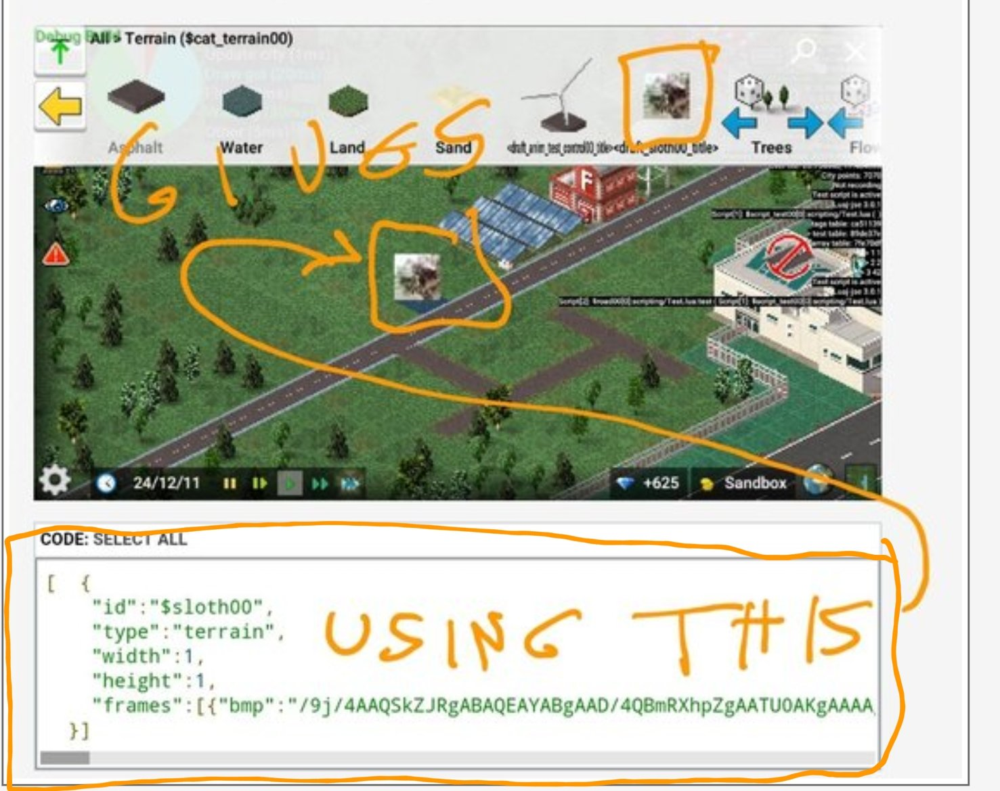

# Using images in json (base 64 encoding)

TheoTown allows you to directly include images that are base 64 encoded into JSON.

1. Use a tool or a website like
[this](https://www.freeformatter.com/base64-encoder.html) to encode an image file to base64.

2. Insert the base64 string into the `bmp` attribute.

For example:
```json
[{
    "id":"$sloth00",
    "type":"terrain",
    "width":1,
    "height":1,
    "frames":[{
        "bmp":"/9j/4AAQSkZJRgABAQEAYABgAAD/4QBmRXhpZgAATU0AKgAAAAgABAEaAAUAAAABAAAAPgEbAAUAAAABAAAARgEoAAMAAAABAAIAAAExAAIAAAAQAAAATgAAAAAAAABgAAAAAQAAAGAAAAABcGFpbnQubmV0IDQuMS4xAP/bAEMAGhITFxMQGhcVFx0bGh8nQConIyMnTzg8L0BdUmJhXFJaWWd0lH5nbYxvWVqBr4KMmZ6mp6ZkfLbDtKHBlKOmn//bAEMBGx0dJyInTCoqTJ9qWmqfn5+fn5+fn5+fn5+fn5+fn5+fn5+fn5+fn5+fn5+fn5+fn5+fn5+fn5+fn5+fn5+fn//AABEIABoAGgMBIgACEQEDEQH/xAAfAAABBQEBAQEBAQAAAAAAAAAAAQIDBAUGBwgJCgv/xAC1EAACAQMDAgQDBQUEBAAAAX0BAgMABBEFEiExQQYTUWEHInEUMoGRoQgjQrHBFVLR8CQzYnKCCQoWFxgZGiUmJygpKjQ1Njc4OTpDREVGR0hJSlNUVVZXWFlaY2RlZmdoaWpzdHV2d3h5eoOEhYaHiImKkpOUlZaXmJmaoqOkpaanqKmqsrO0tba3uLm6wsPExcbHyMnK0tPU1dbX2Nna4eLj5OXm5+jp6vHy8/T19vf4+fr/xAAfAQADAQEBAQEBAQEBAAAAAAAAAQIDBAUGBwgJCgv/xAC1EQACAQIEBAMEBwUEBAABAncAAQIDEQQFITEGEkFRB2FxEyIygQgUQpGhscEJIzNS8BVictEKFiQ04SXxFxgZGiYnKCkqNTY3ODk6Q0RFRkdISUpTVFVWV1hZWmNkZWZnaGlqc3R1dnd4eXqCg4SFhoeIiYqSk5SVlpeYmZqio6Slpqeoqaqys7S1tre4ubrCw8TFxsfIycrS09TV1tfY2dri4+Tl5ufo6ery8/T19vf4+fr/2gAMAwEAAhEDEQA/AOgeUKuFILdAPeqc+oImI5GAcEZxVK6vhDcZlBO7nAwcVRvblZ1aZCwCgfKR1zx+FK4I2WLFA64dQc467eKyzNIxJ2gZ5xxWbCbnIaF3wR/CcZHpV0xuSTlPz/8Ar0mVYvXsG9Mj7/QEDGKpNbziFyyEqfvYHXofy/wrXPShPv0hIxVLFRFAdoU45HJHrT/spP8Ayyz75/8ArUWygahKABgMcD061IWOTyfzoaHc/9k="
    }]
}]
```



- **Why does this feature exist?**

    The feature here is to be able to create plugins that only consist of a single json file that contains all the images in textual representation (that's what base64 is about).


- **Does this solve the issue of running out plugin texture space?**

    Unfortunately not, there's no magic involved. The game does nothing else than getting the image out of the json and putting it into the plugin texture, like with any other image, too.

<sub>
This page has been adapted from
[a topic](https://forum.theotown.com/viewtopic.php?t=8465)
on the official TheoTown forum.
</sub>
